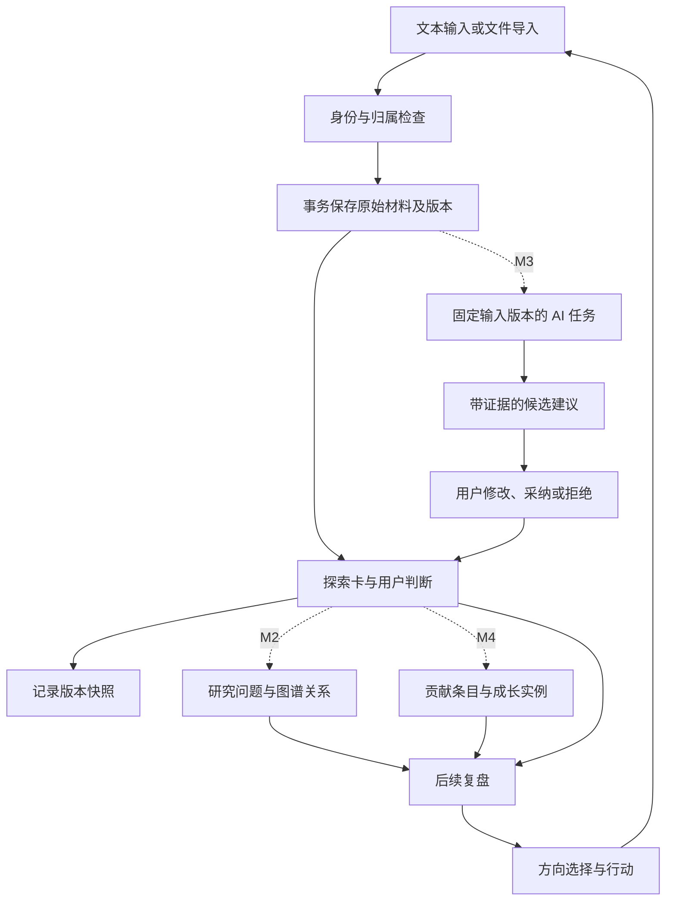
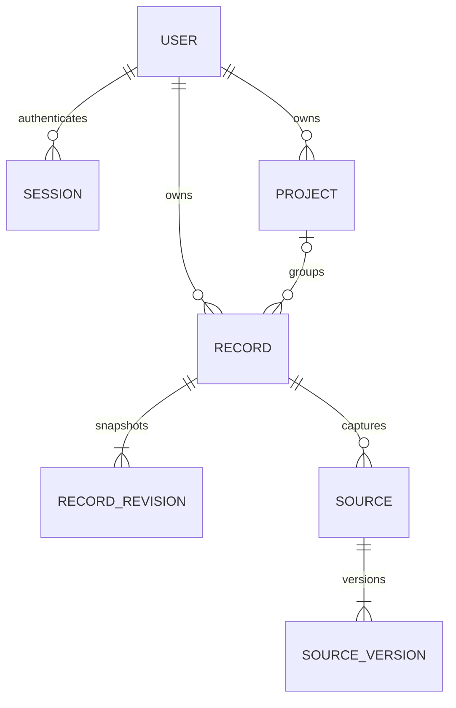

# 全局架构与数据流

版本：M1 · 2026-10-02 · 已实现的技术基线

[项目入口](../README.md) · [产品说明](PROJECT_OVERVIEW.md) · [进度记录](DEVELOPMENT_PROGRESS.md)

本文档是跨模块技术约定的统一来源。产品含义见项目说明，实际验证结果见进度记录。每次接口、数据结构或事务行为变化都必须同步本文件。

## 1. 系统边界

React/TypeScript/Vite 前端通过同源 `/api/v1` 访问 FastAPI。SQLAlchemy 2 使用 Python sqlite3 驱动保存本地数据，Alembic 管理表结构。M1 不依赖 Docker、数据库服务器或模型供应商。

每个后端实例使用一个 SQLite 文件；多账号以所有者字段隔离。不同电脑独立启动时有各自的数据；共享同一后端的账号访问同一文件中各自的数据。Git 仅同步代码、迁移、契约和文档。

| 模块 | 当前代码 | 职责 |
| --- | --- | --- |
| 界面与路由 | `frontend/src/main.tsx`、`ui.tsx`、`style.css` | 登录、项目与记录交互、只显示真实数据 |
| 请求与缓存 | `api.ts`、TanStack Query | Cookie 同源请求、内存 CSRF、错误展示、保存后的缓存更新 |
| API 契约 | `backend/app/main.py`、`schemas.py`、`openapi.json` | 请求校验、HTTP/错误映射、生成前端类型 |
| 会话与归属 | `security.py`、`records.py` | 确定用户、校验所有者与父级对象、限制归档/删除对象 |
| 记录服务 | `records.py` | 创建、CAS 更新、删除恢复、来源修订与事务历史 |
| 存储与运维 | `models.py`、`db.py`、`migrations/`、`scripts/backup.py` | 模型、连接参数、启动迁移与一致性备份 |

## 2. 全项目数据流

M1 实现身份、项目、记录、来源及历史。图谱引用业务对象，不复制正文；布局独立保存。后续贡献、成长和复盘引用固定来源版本，模型建议不能直接覆盖用户判断。

## 3. M1 对象与关系

| 对象 | 约定 |
| --- | --- |
| User | UUID、唯一规范化用户名、显示名称、Argon2 密码哈希 |
| Session | 令牌 SHA-256 摘要、用户、CSRF token、到期时间；有效期七天 |
| Project | 所有者、名称、说明、归档状态；不提供物理删除 |
| Record | 所有者、可空项目、类型、正文及结构化判断、工作/结果状态、版本号、删除时间、创建请求标识及内容摘要 |
| RecordRevision | 每次变更后的完整快照、当时来源版本标识、操作类型；只追加 |
| Source | 所属记录、材料类型、名称、当前版本；原始材料与整理正文分离 |
| SourceVersion | 稳定 UUID、序号、原文或 HTTP(S) URL、UTC 时间；只追加 |

UUID 使用字符串，时间以 UTC 保存并通过带时区的 ISO 8601 输出，快照采用通用 JSON。工作状态为 `planned/in_progress/blocked/paused/finished`；结果判断为 `none/inconclusive/unsupported/preliminary/not_applicable`；类型为 `note/paper/experiment/ai/idea`。

未来对象：ResearchQuestion/Finding/Relation、AITask/Suggestion、Contribution/Skill/GrowthEntry、Direction/Action/Reflection。M1 不创建这些空表。未来引用至少保存来源版本 ID、引用片段和定位信息；来源修订后旧引用仍指向旧内容，同时进入待复核流程。

## 4. 存储生命周期

- 默认 `data/edutoy.sqlite3`；`EDUTOY_DB_PATH` 可覆盖，相对路径始终从仓库根目录解析。
- 统一启动入口创建目录，运行 Alembic，再启动单进程 Uvicorn；迁移失败立即退出，不替换原库。
- 每个连接启用 `foreign_keys=ON`、`busy_timeout=5000`；使用默认 DELETE 日志模式及短事务。
- 每个请求独立数据库会话。SQLite 繁忙返回 503 `database_busy`，前端保留表单。
- 备份使用 sqlite3 backup API；目标必须是新文件。恢复须先停止后端，再替换配置指向的数据库。
- 数据目录、数据库/日志/备份、虚拟环境、环境文件均不进入 Git。
- 测试使用独立临时文件与真实迁移，不读取或清空日常数据库。

`backend/run.py` 是统一启动入口。初始表结构版本为 `0001_m1`；迁移环境启用 `render_as_batch=True`，未来 SQLite 结构变更使用 Alembic 批处理。就绪接口核对数据库版本与当前要求，新增迁移时必须同步更新该要求。备份命令和停服恢复步骤见 README。

## 5. 写入、版本和幂等

1. 创建：探索卡、原始材料、来源首版、记录首版在一个事务中完成。创建请求 UUID 在同一账号内唯一；相同请求与内容返回已有对象，不同内容返回 409。
2. 编辑：客户端发送 `expected_version`；数据库原子条件更新成功后才追加快照。旧版本返回 409，不覆盖较新内容。
3. 来源追加或修订：经记录服务更新记录版本、追加来源版本和历史快照，同事务提交。
4. 删除/恢复：均有版本检查与历史记录。普通查询不返回删除记录；只能通过已删除筛选查看并恢复。
5. 项目归档：保留数据，阻止其记录变更；恢复项目后可继续编辑。归档项目不能接收新记录。
6. 快照包含当时的来源版本 ID。任何材料或记录变化都不会修改旧快照。
7. 模型和其他外部调用不得占用写事务；后续重复采纳以建议 ID 保证幂等，过期输入版本必须复核。

记录编辑、追加材料和材料修订都会递增记录 `version`；删除和恢复同样增加版本。操作类型为 `create/edit/source_add/source_revise/delete/restore`。浏览器编辑表单固定打开时的版本，409 后保留输入，用户明确放弃当前输入后才能重新载入。

幂等标识为每账号内的 `request_id` UUID，数据库保存创建载荷摘要。网络重试必须重用同一个 ID 和原载荷；用户修改载荷后生成新 ID。重放返回同一记录的当前状态，包括可能已被编辑或删除的状态；它不会回滚内容或自动恢复记录。

## 6. 身份与接口

API 前缀 `/api/v1`；规范来源为 FastAPI OpenAPI，前端通过脚本生成类型。所有者由会话决定；对象及父级均检查归属，他人对象返回 404。写请求检查 Origin，已登录写请求同时检查 `X-CSRF-Token`。会话 Cookie 为 HttpOnly、SameSite=Lax；HTTPS 部署启用 Secure。令牌不进入 localStorage。

| 接口 | 能力 |
| --- | --- |
| POST auth/register, auth/login, auth/logout; GET auth/me | 账号与会话 |
| GET/POST projects; GET/PATCH projects/{id} | 项目与归档恢复 |
| GET/POST records; GET/PATCH/DELETE records/{id} | 列表、详情及版本化变更 |
| POST records/import | multipart 单文件导入 |
| POST records/{id}/restore | 版本化恢复 |
| GET records/{id}/revisions | 不可变记录历史 |
| GET/POST records/{id}/sources | 来源查询和追加 |
| GET/POST sources/{id}/versions | 来源历史和修订 |
| GET health/live, health/ready | 存活、迁移就绪检查 |

记录列表返回 `items/total/page/page_size`，默认 20、最大 100 条，界面每页 12 条；项目、历史和单条记录的来源集合返回数组。错误返回 `error.code/message/request_id`，响应头同步 `X-Request-ID`。UUID、状态、字段长度与 URL 由请求模型校验；导入限 `.md/.txt`、1 MiB、UTF-8（可带 BOM），单文件生成一条记录。标题默认首个 Markdown 标题，其次文件名。链接仅保存，不抓取。Markdown 展示禁用原始 HTML，仅允许 HTTP(S) 链接，远程图片显示替代文字，不自动请求外部图片。

### 6.1 请求约定

- `GET records`：`q` 搜索标题、正文和结构化字段的子串（支持中文，`%`/`_` 按文字处理）；`project_id`、`unassigned`、`record_type`、`work_status`、`outcome_status`、`deleted`、`page`、`page_size` 可组合。
- `GET records/{id}?include_deleted=true` 可由所有者查看已删除详情；历史保留可读，来源需恢复记录后读取。未来 AI/图谱的查询入口不得携带此例外。
- `POST records`：`request_id` 必填，标题和正文至少一项非空；`project_id=null` 表示未归类，`fields` 包含六项结构化内容。未指定来源时自动保存首次正文（无正文则保存标题）为原始材料。
- `PATCH records/{id}`：`expected_version` 必填，只改变提交的字段；`fields` 若提交则整体替换，省略的结构化字段为空串。删除、恢复、来源追加和修订也必须发送 `expected_version`。
- `POST records/import`：multipart 字段 `file`、`request_id` 必填；`record_type` 默认为 `note`，`project_id` 可省略。
- `PATCH projects/{id}`：修改 `name/description/archived`；`archived=true/false` 即归档/恢复。项目元数据不维护历史版本，记录变更才使用 CAS。
- 来源内容最多 1,048,576 字符；文件导入上限单独按字节检查。URL 来源只接受 HTTP(S) 且不能携带用户名密码。

核心错误码：`validation_error`（422）、`unauthorized`（401）、`origin_failed/csrf_failed`（403）、`not_found`（404）、`version_conflict/request_conflict/project_archived`（409）、`file_too_large`（413）、`unsupported_file/invalid_encoding/empty_file`（422）、`database_busy/database_unavailable`（503）、`internal_error`（500）。错误响应不回显研究正文或密码。

### 6.2 会话与界面状态

注册即创建会话；重复登录撤销本浏览器旧令牌，其他浏览器的独立会话继续有效。退出删除当前会话并清除 Cookie；到期后接口拒绝访问。`GET auth/me` 返回用户和会话绑定的 CSRF Token，Token 仅保存在前端内存，刷新后重新获取。

未登录入口进入登录页。已打开表单遇到 401 时保留组件和输入，在弹窗中重新登录同一账号，用户再次保存；不会自动重放原请求。网络、锁超时和版本冲突均保留输入；离开未保存页面会提示。退出账号清理查询缓存，避免向下一账号展示前一账号内容。

## 7. 后续模块写入边界

| 模块 | 输入与输出 | 状态与限制 |
| --- | --- | --- |
| M2 图谱 | 问题/发现引用探索卡；关系包含起止节点、类型、依据版本；布局独立 | 所有者校验，删除对象排除，手动编辑通过关系业务接口 |
| M3 AI | 用户选定来源版本 → AITask → 带引用的 Suggestion → 正式对象 | 任务状态 `queued/running/succeeded/failed/cancelled` 与建议状态 `pending/accepted/edited_accepted/rejected` 分开；`needs_review` 独立标记输入过时 |
| M4 成长 | 探索卡与来源 → 用户确认的贡献 → 能力标签与成长实例 | 依据固定版本，用户确认归属，无自动贡献占比或能力总分 |
| 行动与复盘 | 选择已有记录/关系/成长作为证据 → 方向与行动 → 新探索卡 | 调整只经正式业务接口，显式选择，不无声覆盖历史判断 |

AI 任务仅能读取当前用户选择并有权访问的材料，固定输入版本；输出先校验字段和引用，再保存候选。采纳时核对输入仍有效，通过建议 ID 防重复写入，采纳与正式对象同事务保存。模型失败只改变任务状态，不阻止手动操作。上述是未来约定，M1 没有模型调用或模拟 AI 输出。

## 8. 开发与验证原则

先实现后端事务与隔离，再接入中文界面；所有展示来自真实接口。M2/M3/M4 页面明确标注未实现。验证覆盖多账号、幂等、版本冲突、事务回滚、外键、锁超时、历史、导入与重启持久化。

数据库方案由原建议 PostgreSQL 调整为用户指定的 SQLite 本地文件；Docker 及独立数据库服务已退出当前方案。具体测试数量和最终完成状态仅在开发进度文档中记录。
