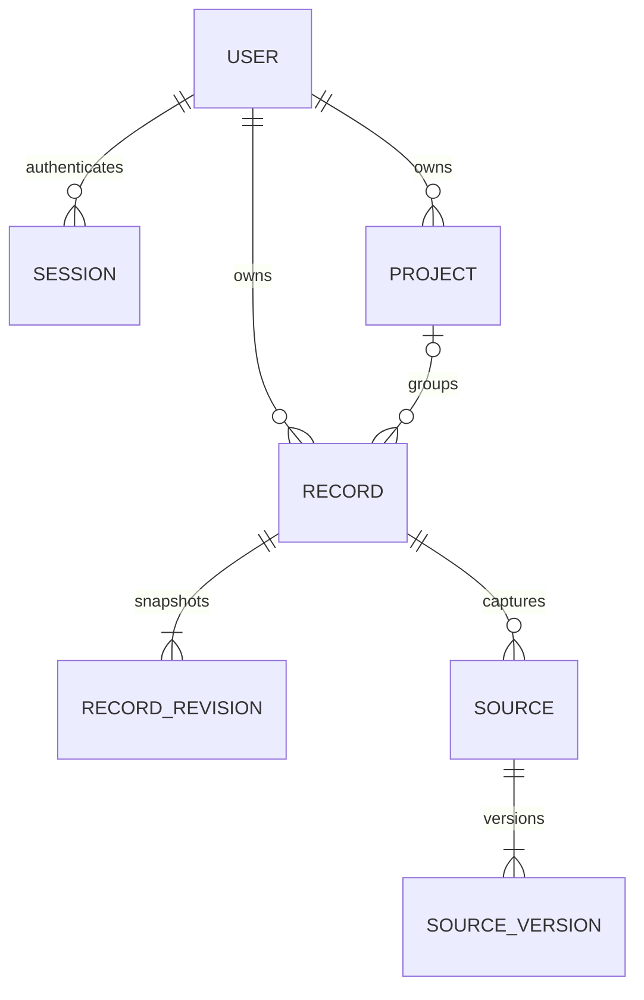
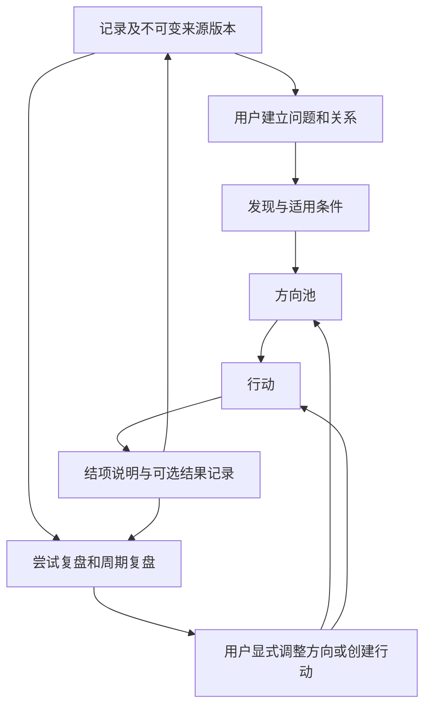
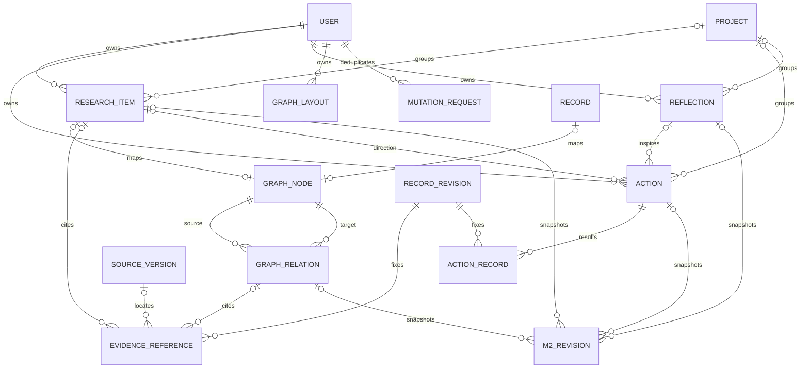
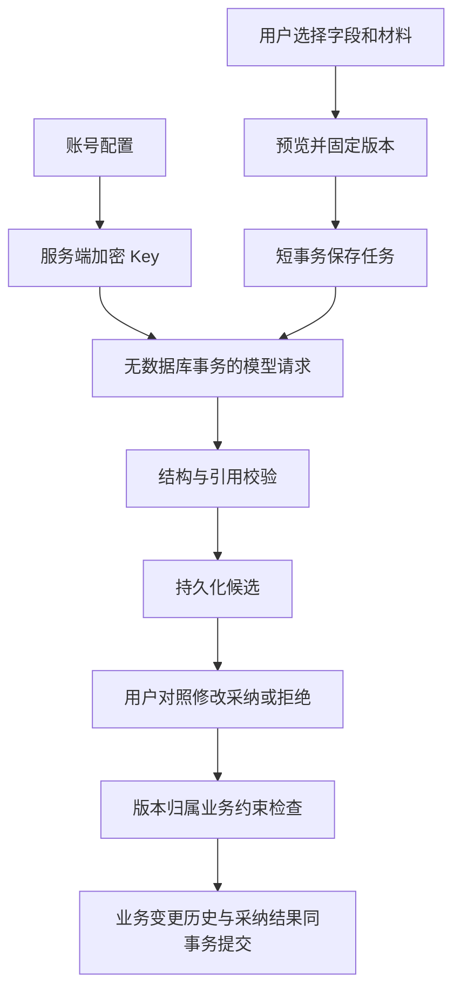
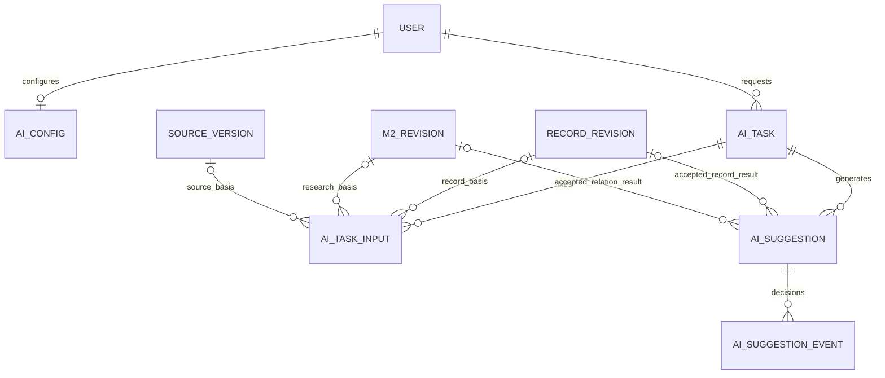

# 全局架构与数据流

版本：M2 · 2026-10-03 · 技术实现与验证基线

[项目入口](../README.md) · [产品说明](PROJECT_OVERVIEW.md) · [进度记录](DEVELOPMENT_PROGRESS.md)

本文档是跨模块技术约定的统一来源。产品含义见项目说明，实际验证结果见进度记录。每次接口、数据结构或事务行为变化都必须同步本文件。

## 1. 系统边界

React/TypeScript/Vite 前端通过同源 `/api/v1` 访问 FastAPI。SQLAlchemy 2 使用 Python sqlite3 驱动保存本地数据，Alembic 管理表结构。本地运行不依赖 Docker 或数据库服务器；手动功能不依赖模型，M3 使用用户配置的兼容模型接口。

每个后端实例使用一个 SQLite 文件；多账号以所有者字段隔离。不同电脑独立启动时有各自的数据；共享同一后端的账号访问同一文件中各自的数据。Git 仅同步代码、迁移、契约和文档。

| 模块 | 当前代码 | 职责 |
| --- | --- | --- |
| 界面与路由 | `frontend/src/main.tsx`、`shell.tsx`、`auth.tsx`、`records.tsx`、`projects.tsx` | 账号、项目与记录页面；地图和规划按路由延迟加载 |
| 地图与规划 | `map.tsx`、`research.tsx`、`planning.tsx`、`actions.tsx`、`reflections.tsx`、`m2-shared.tsx` | 画布/列表、方向、行动、复盘、共用证据与对象选择器 |
| 请求与缓存 | `api.ts`、TanStack Query | Cookie 同源请求、内存 CSRF、错误展示、保存后的缓存更新 |
| API 契约 | `backend/app/main.py`、`api_m1.py`、`api_m2.py`、`schemas*.py`、`openapi.json` | 请求校验、HTTP/错误映射、生成前端类型 |
| 会话与归属 | `security.py`、`records.py` | 确定用户、校验所有者与父级对象、限制归档/删除对象 |
| 记录服务 | `records.py` | 创建、CAS 更新、删除恢复、来源修订与事务历史 |
| M2 命令与投影 | `m2_commands.py`、`m2_common.py`、`m2_queries.py` | 业务命令、固定引用、图查询与分页投影；查询不改正文 |
| 存储与运维 | `models.py`、`models_m2.py`、`db.py`、`migrations/`、`scripts/backup.py` | 模型、连接参数、启动迁移与一致性备份 |

## 2. 全项目数据流

M1 实现身份、项目、记录、来源及历史。图谱引用业务对象，不复制正文；布局独立保存。M2 问题、发现、方向、关系、行动与复盘见第 9 节。后续贡献、成长继续引用固定来源版本，模型建议不能直接覆盖用户判断。

## 3. M1 对象与关系

| 对象 | 约定 |
| --- | --- |
| User | UUID、唯一规范化用户名、显示名称、Argon2 密码哈希 |
| Session | 令牌 SHA-256 摘要、用户、CSRF token、到期时间；有效期七天 |
| Project | 所有者、名称、说明、归档状态；不提供物理删除 |
| Record | 所有者、可空项目、类型、正文及结构化判断、工作/结果状态、版本号、删除时间、创建请求标识及内容摘要 |
| RecordRevision | 每次变更后的完整快照、当时来源版本标识、操作类型；只追加 |
| Source | 所属记录、材料类型、名称、当前版本；原始材料与整理正文分离 |
| SourceVersion | 稳定 UUID、序号、原文或 HTTP(S) URL、UTC 时间；只追加 |

UUID 使用字符串，时间以 UTC 保存并通过带时区的 ISO 8601 输出，快照采用通用 JSON。工作状态为 `planned/in_progress/blocked/paused/finished`；结果判断为 `none/inconclusive/unsupported/preliminary/not_applicable`；类型为 `note/paper/experiment/ai/idea`。

M2 新增研究内容、节点、关系、固定证据、行动、复盘、布局与修订表。M3 已增加 AIConfig/AITask/AITaskInput/AISuggestion/AISuggestionEvent；未来 Contribution/Skill/GrowthEntry 不创建空表，按对应里程碑迁移；继续沿用固定版本引用和显式确认。

## 4. 存储生命周期

- 默认 `data/edutoy.sqlite3`；`EDUTOY_DB_PATH` 可覆盖，相对路径始终从仓库根目录解析。
- 统一启动入口创建目录，运行 Alembic，再启动单进程 Uvicorn；迁移失败立即退出，不替换原库。
- 每个连接启用 `foreign_keys=ON`、`busy_timeout=5000`；使用默认 DELETE 日志模式及短事务。
- 每个请求独立数据库会话。SQLite 繁忙返回 503 `database_busy`，前端保留表单。
- 备份使用 sqlite3 backup API；目标必须是新文件。恢复须先停止后端，再替换配置指向的数据库。
- 数据目录、数据库/日志/备份、虚拟环境、环境文件均不进入 Git。
- 测试使用独立临时文件与真实迁移，不读取或清空日常数据库。

`backend/run.py` 是统一启动入口。初始表结构版本为 `0001_m1`；迁移环境启用 `render_as_batch=True`，未来 SQLite 结构变更使用 Alembic 批处理。就绪接口动态读取 Alembic 当前 head，与数据库 `alembic_version` 比较；目前 head 为 `0002_m2`。备份命令和停服恢复步骤见 README。

## 5. 写入、版本和幂等

1. 创建：探索卡、原始材料、来源首版、记录首版在一个事务中完成。创建请求 UUID 在同一账号内唯一；相同请求与内容返回已有对象，不同内容返回 409。
2. 编辑：客户端发送 `expected_version`；数据库原子条件更新成功后才追加快照。旧版本返回 409，不覆盖较新内容。
3. 来源追加或修订：经记录服务更新记录版本、追加来源版本和历史快照，同事务提交。
4. 删除/恢复：均有版本检查与历史记录。普通查询不返回删除记录；只能通过已删除筛选查看并恢复。
5. 项目归档：保留数据，阻止其记录变更；恢复项目后可继续编辑。归档项目不能接收新记录。
6. 快照包含当时的来源版本 ID。任何材料或记录变化都不会修改旧快照。
7. 模型和其他外部调用不得占用写事务；后续重复采纳以建议 ID 保证幂等，过期输入版本必须复核。

记录编辑、追加材料和材料修订都会递增记录 `version`；删除和恢复同样增加版本。操作类型为 `create/edit/source_add/source_revise/delete/restore`。浏览器编辑表单固定打开时的版本，409 后保留输入，用户明确放弃当前输入后才能重新载入。

幂等标识为每账号内的 `request_id` UUID，数据库保存创建载荷摘要。网络重试必须重用同一个 ID 和原载荷；用户修改载荷后生成新 ID。重放返回同一记录的当前状态，包括可能已被编辑或删除的状态；它不会回滚内容或自动恢复记录。

## 6. 身份与接口

API 前缀 `/api/v1`；规范来源为 FastAPI OpenAPI，前端通过脚本生成类型。所有者由会话决定；对象及父级均检查归属，他人对象返回 404。写请求检查 Origin，已登录写请求同时检查 `X-CSRF-Token`。会话 Cookie 为 HttpOnly、SameSite=Lax；HTTPS 部署启用 Secure。令牌不进入 localStorage。

| 接口 | 能力 |
| --- | --- |
| POST auth/register, auth/login, auth/logout; GET auth/me | 账号与会话 |
| GET/POST projects; GET/PATCH projects/{id} | 项目与归档恢复 |
| GET/POST records; GET/PATCH/DELETE records/{id} | 列表、详情及版本化变更 |
| POST records/import | multipart 单文件导入 |
| POST records/{id}/restore | 版本化恢复 |
| GET records/{id}/revisions | 不可变记录历史 |
| GET/POST records/{id}/sources | 来源查询和追加 |
| GET/POST sources/{id}/versions | 来源历史和修订 |
| GET health/live, health/ready | 存活、迁移就绪检查 |

记录列表返回 `items/total/page/page_size`，默认 20、最大 100 条，界面每页 12 条；项目、历史和单条记录的来源集合返回数组。错误返回 `error.code/message/request_id`，响应头同步 `X-Request-ID`。UUID、状态、字段长度与 URL 由请求模型校验；导入限 `.md/.txt`、1 MiB、UTF-8（可带 BOM），单文件生成一条记录。标题默认首个 Markdown 标题，其次文件名。链接仅保存，不抓取。Markdown 展示禁用原始 HTML，仅允许 HTTP(S) 链接，远程图片显示替代文字，不自动请求外部图片。

### 6.1 请求约定

- `GET records`：`q` 搜索标题、正文和结构化字段的子串（支持中文，`%`/`_` 按文字处理）；`project_id`、`unassigned`、`record_type`、`work_status`、`outcome_status`、`deleted`、`page`、`page_size` 可组合。
- `GET records/{id}?include_deleted=true` 可由所有者查看已删除详情；历史保留可读，来源需恢复记录后读取。未来 AI/图谱的查询入口不得携带此例外。
- `POST records`：`request_id` 必填，标题和正文至少一项非空；`project_id=null` 表示未归类，`fields` 包含六项结构化内容。未指定来源时自动保存首次正文（无正文则保存标题）为原始材料。
- `PATCH records/{id}`：`expected_version` 必填，只改变提交的字段；`fields` 若提交则整体替换，省略的结构化字段为空串。删除、恢复、来源追加和修订也必须发送 `expected_version`。
- `POST records/import`：multipart 字段 `file`、`request_id` 必填；`record_type` 默认为 `note`，`project_id` 可省略。
- `PATCH projects/{id}`：修改 `name/description/archived`；`archived=true/false` 即归档/恢复。项目元数据不维护历史版本，记录变更才使用 CAS。
- 来源内容最多 1,048,576 字符；文件导入上限单独按字节检查。URL 来源只接受 HTTP(S) 且不能携带用户名密码。

核心错误码：`validation_error`（422）、`unauthorized`（401）、`origin_failed/csrf_failed`（403）、`not_found`（404）、`version_conflict/request_conflict/project_archived`（409）、`file_too_large`（413）、`unsupported_file/invalid_encoding/empty_file`（422）、`database_busy/database_unavailable`（503）、`internal_error`（500）。错误响应不回显研究正文或密码。

### 6.2 会话与界面状态

注册即创建会话；重复登录撤销本浏览器旧令牌，其他浏览器的独立会话继续有效。退出删除当前会话并清除 Cookie；到期后接口拒绝访问。`GET auth/me` 返回用户和会话绑定的 CSRF Token，Token 仅保存在前端内存，刷新后重新获取。

未登录入口进入登录页。已打开表单遇到 401 时保留组件和输入，在弹窗中重新登录同一账号，用户再次保存；不会自动重放原请求。网络、锁超时和版本冲突均保留输入；离开未保存页面会提示。退出账号清理查询缓存，避免向下一账号展示前一账号内容。

## 7. 跨模块写入边界

| 模块 | 输入与输出 | 状态与限制 |
| --- | --- | --- |
| M2 图谱 | 问题/发现引用探索卡；关系包含起止节点、类型、依据版本；布局独立 | 所有者校验，删除对象排除，手动编辑通过关系业务接口 |
| M3 AI | 用户选定来源版本 → AITask → 带引用的 Suggestion → 正式对象 | 任务状态 `queued/running/succeeded/failed/cancelled` 与建议状态 `pending/accepted/edited_accepted/rejected` 分开；`needs_review` 独立标记输入过时 |
| M4 成长 | 探索卡与来源 → 用户确认的贡献 → 能力标签与成长实例 | 依据固定版本，用户确认归属，无自动贡献占比或能力总分 |
| 行动与复盘 | 选择已有记录/关系/成长作为证据 → 方向与行动 → 新探索卡 | 调整只经正式业务接口，显式选择，不无声覆盖历史判断 |

AI 任务仅能读取当前用户选择并有权访问的材料，固定输入版本；输出先校验字段和引用，再保存候选。采纳时核对输入仍有效，通过建议 ID 防重复写入，采纳与正式对象同事务保存。模型失败只改变任务状态，不阻止手动操作。M3 已实现手动选择材料后的真实兼容 API 调用；测试模拟服务独立于正式应用，详见第 10 节。

## 8. 开发与验证原则

先实现后端事务与隔离，再接入中文界面；所有展示来自真实接口。M2 开放手动地图和下一步；“我的成长”仍标注待开发。验证覆盖多账号、幂等、版本冲突、事务回滚、外键、锁超时、历史、导入与重启持久化。

数据库方案由原建议 PostgreSQL 调整为用户指定的 SQLite 本地文件；Docker 及独立数据库服务已退出当前方案。具体测试数量和最终完成状态仅在开发进度文档中记录。

## 9. M2 研究地图与行动闭环

本轮开放研究地图与下一步：问题 → 主动关联记录 → 发现 → 跨项目方向 → 行动 → 结果记录 → 手动复盘。M3 的记录/关系 AI 见第 10 节，成长仍留在 M4。记录不自动入图，结项只要求一句结果说明。

### 对象与数据边界

- ResearchItem 使用 kind=question/finding/direction；正文属于业务对象，差异字段由 Pydantic 严格校验。kind 创建后固定。
- GraphNode 只映射 Record 或 ResearchItem；两个可空外键必须恰好一个有值，目标唯一，不复制标题正文。关系只引用节点。
- GraphRelation 保存有向类型、说明、两端确认版本和证据；普通关联可不写理由，其他关系必须填写。子问题只能连接问题，一个子问题只有一个父问题且不能成环。
- EvidenceReference 固定 record_revision_id，可带 source_version_id、字段路径、Unicode 字符位置和原文片段。引用选定来源时必须出现在该记录快照的来源列表中。
- Action、ActionRecord 管理执行与多对多结果引用；结项不自动关闭方向或改变研究结果。
- Reflection 保存用户复盘及选定记录/行动/研究内容的修订标识；周期默认本地自然周，以 UTC 半开区间查询，保存时区。
- 业务修订只追加；M2 每次正文、状态、证据变化追加完整快照。MutationRequest 保存用户、操作、请求摘要和结果标识，重复调用不重复创建。
- GraphLayout 按账号和 scope（all/project/unassigned）保存坐标，独立 CAS 版本，不改变正文和证据状态。

### 写入与引用生命周期

记录服务内部仅 flush，由请求或复合命令外层提交；结项、可选新记录与可选关联同事务提交。所有写请求在读取会话及业务状态前使用短的 SQLite IMMEDIATE 事务串行校验关系约束，仍采用 5 秒忙等待和原子版本检查。

来源/端点更新后旧引用保留并提示复核；可确认旧依据仍适用，或显式选择新依据。已删除来源返回占位而不再返回引用原文；恢复后重新可读。删除节点仅使相关连线不可见，不级联删除他人对象、其他记录或行动；单独删除的连线不会因节点恢复而自动恢复。归档对象只读。

### 地图投影与界面

项目地图含本项目及直接相连的外部节点，外部节点有项目标识；个人总览覆盖账号内有效内容。记录仅在存在有效关系时入图。单次画布最多 150 节点并返回 total_nodes/truncated，列表可分页访问完整内容。拖动位置单独保存，刷新不自动重排；用户可触发 Dagre 整理。窄屏默认列表，所有关系操作均有表单入口。

### 接口与实施顺序

所有接口仍位于 `/api/v1`，所有权、UUID、CSRF、错误与分页遵守 M1。

| 接口组 | 能力与关键输入 |
| --- | --- |
| `/research-items`、`/{id}` | GET/POST 列表与创建、GET/PATCH/DELETE 单项；kind 创建后固定 |
| `/relations`、`/{id}` | 分页查询、创建/编辑/删除；输入类型化 source/target 引用，由后端解析节点 |
| `/research-items/{id}/review`、`/relations/{id}/review` | POST `expected_version`，可提交新 evidence；确认现有依据仍适用 |
| 上述对象及 `/actions`、`/reflections` 的 `/{id}/restore`、`/revisions` | POST 版本化恢复、GET 不可变快照；不提供回滚 |
| `/graph` | GET 总览/项目/未归类、关键词、类型、状态、待复核、归档、focus/depth；最多 150 节点 |
| `/graph/candidates` | GET 完整对象分页，含未入图记录；`unlinked=true` 筛选待关联记录 |
| `/graph/layout` | GET/PUT 用户与 scope 布局；`expected_version=0` 创建，后续 CAS；只更新提交节点坐标 |
| `/actions`、`/{id}` | 分页查询、创建/编辑/删除及结果记录关联；从方向创建时可默认继承项目 |
| `/actions/{id}/complete` | POST `expected_version/request_id/result_summary`，可带 records/new_record/link_direction；单事务 |
| `/actions/{id}/reopen` | POST `expected_version/request_id/reason`；结项历史保留 |
| `/reflections`、`/{id}` | 尝试/周期复盘创建、列表、编辑、删除；材料是固定版本引用 |
| `/reflections/materials` | GET 时间区间内记录、行动、研究内容最新一次变化，可搜索/项目筛选/分页 |
| `/records/{id}/context` | GET 记录相关的关系、行动及直接选择它的复盘 |

图返回 `nodes/edges/total_nodes/truncated`，节点只带摘要、标识、项目、状态、版本、跨项目和归档标识。未映射的候选记录用 `record:<UUID>` 作为候选 UI 标识，建立关系时只发送业务对象 UUID；不允许把候选标识当成图节点写入布局。

新增错误码包括 `duplicate_relation`、`parent_exists`、`question_cycle`、`self_relation`、`invalid_subquestion`、`immutable_kind`、`invalid_evidence`、`source_deleted`、`use_status_command`。冲突保持当前输入，重新载入需明确放弃当前草稿。

先拆分与事务改造，再迁移 0002_m2、地图、行动、复盘、回归。就绪状态比较 Alembic head。升级前备份日常数据；测试只使用临时库，包括 M1 → M2 升级、500 节点/1000 关系、账号隔离、幂等/回滚及窄屏流程。最终实测结果记入开发进度。

### M2 关系结构

GraphNode 的 record/item 外键、EvidenceReference 的 item/relation 外键、M2Revision 的四个业务外键均有“恰好一个非空”的数据库约束。Reflection 的多态材料引用保存在 JSON，通过所有权、对象 ID 和对应修订归属联合校验；历史引用不允许更换为别人的版本。方向外键必须指向 kind=direction 的 ResearchItem，由业务服务校验。

### 状态与方向语义

| 内容 | 状态 |
| --- | --- |
| 问题 | exploring 探索中、paused 暂缓、answered 已有回答 |
| 发现 | tentative 暂定、reviewed 已核对、withdrawn 已撤回 |
| 方向 | candidate 候选、focus 当前重点、paused 暂缓、closed 已关闭；优先级 high/normal/low |
| 行动 | planned 待开始、in_progress 进行中、blocked 受阻、paused 暂缓、completed 已完成、cancelled 已取消 |
| 尝试复盘选择 | continue 继续、adjust 调整、pause 暂缓、finish 结束；不自动改变对象状态 |

关系始终读作 A → B：related 关联、subquestion A 是 B 的子问题、derived_from A 源于 B、tests A 验证 B、supports A 支持 B、challenges A 质疑 B、extends A 延伸 B、reuses A 复用 B。除 related 外均填写理由，没有证据则明确标注“未附证据”。活跃同起点/终点/类型关系唯一；subquestion 起点唯一，其他类型可以形成循环。

### 证据复核与历史展示

- 引用正文保存字段路径和 Unicode 码点区间 `[start,end)`；引用来源保存其固定来源版本内区间，后端验证原文严格匹配。整字段引用不必提供片段。
- `reviewed_record_version` 是用户最近确认该固定依据仍适用时的记录版本，不改变 `record_revision_id` / `source_version_id`。普通编辑保留未变化证据的确认信息；已经处于 reviewed 的发现不会因普通编辑自动清除新的复核提示。
- 首次标记发现为 reviewed 需至少一个有效依据，界面要求勾选核对声明；之后可通过专门复核命令确认旧依据，或编辑选择新版本。
- 关系还比较两端业务版本，删除/恢复同样触发复核；布局更新不影响业务版本。复盘材料始终展示选定修订，不用最新正文替换。
- 历史中的 evidence/results/materials 读取时检查当前来源可用性；被删除的来源只显示占位，原历史标识保留；恢复后重新可读。原始历史 JSON 不改写。编辑自己的文字时可保留同一对象已经引用的删除来源，不得把已删除来源新增到别的对象；占位引用恢复后仍可追溯。
- 复盘保存成功后，创建行动或调整方向使用独立页面和业务命令；后续操作失败不撤销已保存复盘。

实现参考：[React Flow](https://reactflow.dev/learn)、[Dagre 布局示例](https://reactflow.dev/examples/layout/dagre)、[Alembic SQLite 批处理](https://alembic.sqlalchemy.org/en/latest/batch.html)。

## 10. M3：模型配置、任务与候选采纳（已实施，真实接口验收待完成）

M3 只整理已有探索卡、建议已有对象之间的关系。AI 规划、复盘生成与贡献成长仍待后续。每个账号维护一套 OpenAI Chat Completions 兼容配置：URL、模型名、API Key；URL 保留路径，仅在非完整地址后追加 `/chat/completions`，不追加 `/v1`，不跟随重定向。HTTPS 云端与 HTTP 本机回环可用。

### 10.1 模型与凭据

新增 `0003_m3`：AIConfig（账号独立配置）、AITask（任务/非敏感配置快照）、AITaskInput（固定输入与真实外键）、AISuggestion（不可变候选与最终采纳结果）、AISuggestionEvent（处理事件）。输入引用记录修订或研究内容修订，来源必须属于该记录修订。任务不复制 Key，正式记录/关系继续通过既有业务服务写入。

AITaskInput 的记录与研究对象引用互斥，并分别引用真实对象及其修订。配置版本是任务执行前的校验条件；任务保留地址、模型和版本快照，不依赖配置仍然存在，也不保存密钥副本。

API Key 使用 cryptography Fernet 加密落库。主密钥默认 `data/ai-master.key`，可通过 `EDUTOY_AI_KEY_PATH` 配置，相对路径从仓库根目录解析；首次需要时生成，POSIX 0600。已有密文但文件缺失时禁止自动替换，AI 暂不可用，手动功能继续。数据库备份不包含主密钥，迁移电脑时需分别恢复。Key 不进入响应、浏览器持久存储、日志、提示词和任务快照。修改请求地址必须重新输入 Key。

### 10.2 任务与事务

任务状态 queued/running/succeeded/failed/cancelled；建议状态 pending/accepted/edited_accepted/rejected。后端生命周期运行执行器，SQLite 持久排队；全局最多 2 个运行，每账号 1 个运行、5 个排队。连接测试同样是任务，仅发送固定文本。连接超时 10 秒，总时限 120 秒，响应最多 1 MiB，无自动重试。启动将中断的 running 标为 failed，queued 重新校验后继续；取消通过状态条件防止迟到响应覆盖。

创建任务先提交；执行器短事务读取/认领，关闭会话后调用模型，再短事务保存候选。任何外部等待不得持有 SQLite 事务。配置版本改变后排队任务失败，不静默替换配置；清除配置取消未完成任务。创建/重试使用请求 UUID 幂等；采纳与业务历史原子提交，并以建议唯一结果防重复。

### 10.3 选择、输出与复核

单次最多 32,000 Unicode 字符，不截断；整理一条记录，关联任务 2–20 对象且至少一条记录，最多 10 条建议。只发送勾选字段/来源，不抓网页、不扫描其他对象。材料编号由后端分配，引用返回编号/原文/出现序号，后端定位并校验；研究对象只能作端点，证据来自固定记录/来源版本。输出 JSON 经过 Pydantic 和引用校验，失败不创建部分候选；空关系列表是合法结果。

整理只建议标题、类型、六个结构字段；缺失信息留空，未表达的个人判断不得补写。采纳仅合并用户勾选字段，不改原始正文、来源、项目或状态。非空结构字段必须有片段引用。关系建议沿用八种类型与现有约束，候选不进入图谱。用户编辑和原始候选分别保留。

输入更新时 pending 建议提示待复核；保留旧依据须提交用户确认的当前版本映射，采纳事务中再次核对。删除输入时材料和依赖候选隐藏，恢复后可读；归档内容只读。已采纳正式内容和采纳历史保留。错误、冲突、会话过期保留前端输入。

### 10.4 API 与验证

`/api/v1/ai`：config GET/PUT/DELETE、config/test POST、preview POST、tasks GET/POST、tasks/{id} GET、cancel/retry POST、suggestions GET、suggestions/{id} GET、accept/reject POST、suggestions/reject-batch POST。沿用账号/CSRF/Origin、统一错误、分页及 OpenAPI 类型生成；模型 401 作为任务错误，不触发应用退出。

前端账号区模型设置；记录详情 AI 整理、地图 AI 建议关联、科研记录 AI 收件箱。预览显示实际发送内容、地址和模型；字段对照选择、逐条采纳与批量拒绝。任务每 2 秒轮询，终态停止。

测试使用独立 SQLite/主密钥与本地模拟 HTTP 服务。35 项后端与 14 项浏览器测试为 M2 回归基线，新增密钥、网络、任务生命周期、引用、复核、采纳原子性与移动端覆盖。真实兼容接口验收另行记录，未配置真实凭据时不得将模拟测试等同于真实验收。
M3 实际模块：`models_ai.py` / `schemas_ai.py` 定义存储与契约；`ai_credentials.py` 管理加密与配置；`ai_data.py` 定位材料、校验引用并投影删除/更新状态；`ai_prompts.py` 管理 m3.v1 提示词；`ai_worker.py` 执行受限 HTTP 调用；`ai_commands.py` 处理事务与采纳；`api_ai.py` 暴露接口。前端模型设置、材料选择、收件箱分别延迟加载，共用生成的 API 类型。

采纳产生的 RecordRevision/Revision 使用 `ai_accept` 操作名，在同一首次快照中记录 `ai_suggestion_id`；历史页可回到建议。模型调用只含选定材料，当前材料对照仅返回当前用户的界面，不加入外发提示。错误状态和取消通过数据库任务状态检查保护，建议全部校验成功后才一起保存。配置清除保留递增版本，避免旧排队任务错误地使用重新创建的配置。
