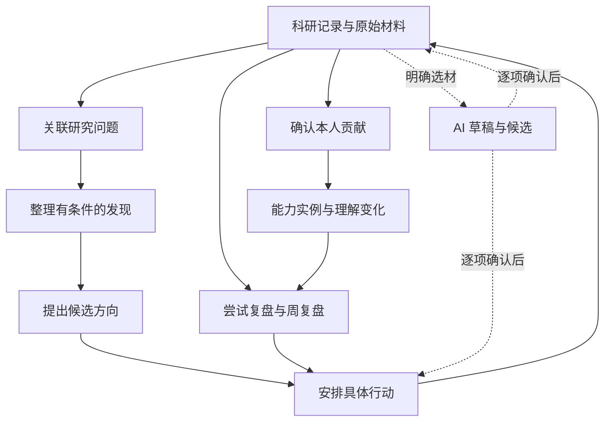

# 研迹功能全景与操作指南

版本：v1.0 · 更新日期：2026-10-04 · 对应 M1–M5-A 首版功能

[返回 README](../README.md) · [功能规格](requirements/functional_specification.md) · [项目说明](PROJECT_OVERVIEW.md) · [功能测试文档](FUNCTIONAL_TESTS.md) · [开发进度](DEVELOPMENT_PROGRESS.md)

本文面向准备了解产品、参与测试和课程演示的组员。按实际页面介绍功能用途、入口、操作、保存结果和限制；不需要先读懂后端接口或数据库设计。

**当前状态是主要功能代码已实现，待集中验证。** 下文描述实现所对应的操作与预期行为，不是本轮测试通过报告。若实际界面或结果与说明不同，请记录差异，按测试文档登记缺陷。本次指南编写只核对代码和文档，未启动应用、执行功能测试或调用模型。

## 阅读与上手顺序

1. 按 [README 的安装说明](../README.md#本地安装与启动)安装依赖。准备测试时，使用[功能测试文档中的隔离环境](FUNCTIONAL_TESTS.md#21-隔离环境)，不要在日常科研数据库中试删数据或制造错误。
2. 先阅读下面的功能全景和基本概念，了解四个页面之间的关系。
3. 按[完整体验路线](#完整体验路线)用同一组虚构材料串起功能。没有模型配置时，可以先完成全部手动部分。
4. 正式测试时转到对应 `FT-` 用例，记录实际代码版本、步骤、结果和证据。体验过某个页面不等于该模块全部通过。

本指南负责“怎样理解和使用”，[项目说明](PROJECT_OVERVIEW.md)负责产品范围，[架构文档](ARCHITECTURE.md)负责数据约定，[测试文档](FUNCTIONAL_TESTS.md)负责验收标准，[进度记录](DEVELOPMENT_PROGRESS.md)负责实际完成情况。后续功能变更需同步这些文档中受影响的部分。

快速定位：[功能全景](#功能全景与基本概念) · [账号与项目](#账号与项目) · [科研记录](#科研记录) · [研究地图](#研究地图) · [下一步](#下一步) · [我的成长](#我的成长) · [五类 AI](#模型设置和五类-ai-功能) · [数据导出](#数据导出与本地备份) · [常见疑问](#共同规则和常见疑问) · [完整体验](#完整体验路线) · [测试交接](#从体验转入正式测试)

## 功能全景与基本概念

### 从页面找到功能

下表路径均相对于应用地址。默认开发地址为 `http://127.0.0.1:5173`，手工测试地址按测试环境配置。部分旧页面仍带有 M1/M2 等阶段标识，查找功能以主导航和按钮名称为准。

| 页面或入口 | 路径 | 可以做什么 |
| --- | --- | --- |
| 科研记录 | `/records` | 创建和导入记录，编辑探索卡，搜索筛选，查看来源及历史，删除恢复，进入关联、成长、复盘和 AI 操作 |
| 科研记录 → AI 收件箱 | `/records/ai` | 查看任务与候选，核对、修改、采纳、拒绝，取消任务或显式重试 |
| 研究地图 | `/map` | 创建问题、发现、方向，主动关联记录，编辑八种关系，查看跨项目联系，保存布局 |
| 我的成长 | `/growth` | 贡献时间线、能力标签与实例、理解变化、固定依据、据此创建行动 |
| 下一步 | `/next` | 方向池、行动、尝试复盘和周期复盘，AI 行动建议与周复盘辅助 |
| 研究项目 → 管理项目与归档 | 侧栏弹窗；窄屏可用“管理项目”按钮 | 新建项目，修改名称与说明，归档或恢复 |
| 账号区 → 模型设置 | `/settings/model` | 保存自己的兼容模型接口，测试连接，替换或清除配置 |
| 账号区 → 数据导出 | `/settings/export` | 选择范围，预览后下载 JSON 或 Markdown |

侧栏项目快捷入口打开的是该项目的**科研记录列表**。地图、成长和下一步各有自己的项目筛选；切换到另一个页面时，应核对该页面当前的范围，不要假定全应用同步切换。

### 对象分别表达什么

| 对象 | 回答的问题 | 示例 |
| --- | --- | --- |
| 项目 | 这些内容放在哪个研究主题下？ | 检索实验、评估方法 |
| 科研记录／探索卡 | 我做了什么尝试，当时怎样判断？ | 增加训练轮数的两次实验没有改善 |
| 原始材料 | 当时输入或引用的原文是什么？ | 导入的实验笔记、补充文本、论文链接 |
| 研究问题 | 我希望弄清什么？ | 数据分布是否影响检索结果？ |
| 发现 | 当前观察或解释是什么，适用于什么条件？ | 当前设置下，两次尝试均未见提升 |
| 候选方向 | 值得继续探索的选择是什么？ | 按数据分布分组评估 |
| 行动 | 下一次具体做什么，怎样算完成？ | 完成一次分组对照并记录设置与结果 |
| 复盘 | 如何解释这次经历，下一步怎样选择？ | 现有结果不足以归因，准备调整验证方法 |
| 个人贡献 | 我本人作出了什么判断或行动？ | 我补充了对照条件 |
| 能力实例 | 哪段经历体现了我的练习和学习？ | 在帮助下完成实验设计，仍不熟悉混杂因素控制 |
| 理解变化 | 之前和现在如何理解同一个问题？ | 从“增加轮数就会改善”转向“需要先检查分布差异” |
| AI 任务与建议 | 模型处理到了哪一步，哪些输出尚待我确认？ | 一次整理任务生成了待确认草稿 |

“探索卡”就是一条科研记录的结构化表达。编辑卡片不会覆盖独立保存的原始材料。方向和行动也各自保存：一个方向可有多次行动，一次行动完成并不代表方向已经解决。



图中表示用户可以执行的衔接，不代表系统自动生成后续对象。贡献、成长、行动和复盘不另建地图节点；地图节点只有问题、记录、发现、方向四类。

## 账号与项目

### 注册登录与数据归属

**入口：** 未登录时的登录页，可切换注册；登录后账号区可退出。

1. 注册填写用户名、显示名称和密码；用户名用于登录，显示名称用于界面展示。用户名为 3–32 位英文字母、数字或下划线，大小写归一后不能重名；密码 8–128 字符，显示名称 1–80 字符。无需邮箱。
2. 注册后进入个人空间，刷新仍可保持登录；退出后用同一账号登录，应看到原有数据。
3. 测试第二个账号时使用另一个浏览器会话或无痕窗口。不同账号的项目、记录、模型设置和所有业务对象互相隔离。

每台电脑独立运行后端时有自己的 SQLite 数据文件。推送或拉取 GitHub 只同步代码和文档，不同步组员账号和科研数据。目前没有共享项目、云同步、邮箱验证或找回密码。

会话过期时页面提供重新登录；先保留当前表单，使用原账号重新认证后再保存。**未保存输入不是持久草稿**，关闭页面或明确放弃修改仍可能丢失。

对应测试：[账号与会话](FUNCTIONAL_TESTS.md#41-账号与会话)，`FT-AUTH-001` 至 `FT-AUTH-006`。

### 创建修改归档和恢复项目

**入口：** 侧栏“管理项目与归档”或“管理项目”图标。

1. 点击“新建项目”，填写必填名称和可选说明，点击“保存项目”。
2. 在项目列表中选中项目，修改名称、说明并保存。
3. 用项目旁的归档按钮归档，恢复按钮恢复。归档保留业务内容；归档项目内的内容只读，需恢复后继续编辑或建立关联。
4. 点击侧栏项目查看记录，或在各页面筛选器中选择该项目。“全部项目”汇总当前账号，“未归类”只看未设置项目的对象。

可以不创建项目就保存记录、方向、行动、贡献和成长。修改对象所属项目是重新归类，不产生副本，已有关系仍保留。归档内容的显示以当前页面筛选为准；地图、成长、导出有显式包含归档的选项。

对应测试：[项目管理](FUNCTIONAL_TESTS.md#42-项目管理)，`FT-PROJ-001` 至 `FT-PROJ-004`。

## 科研记录

### 新建和编辑探索卡

**入口：** “科研记录 → 新建记录”；已有记录详情点击“编辑”。前置条件仅为已登录且目标项目可编辑。

1. 选择随手记、论文阅读、实验尝试、AI 协作或灵感疑问，填写标题或正文至少一项，项目可留“暂未归类”。
2. 按需要填写工作状态、结果判断和“进一步整理”中的字段。
3. 点击“保存记录”。列表与详情更新，保存的当前内容可在刷新后继续查看；每次变更留有历史快照。

| 字段 | 应该写什么 |
| --- | --- |
| 记录正文 | 原始笔记或本次活动的完整说明；支持安全 Markdown 展示 |
| 背景与目标 | 为什么开始，希望弄清什么 |
| 我的行动 | 自己实际做过的操作和选择 |
| AI 与他人的帮助 | 外部建议与协作情况 |
| 观察与结果 | 实际发生了什么，哪些结果尚未知 |
| 我的判断 | 自己如何解释结果，与观察事实分开 |
| 后续想法 | 待验证的问题或下一次尝试 |

| 属性 | 可选值 | 如何理解 |
| --- | --- | --- |
| 工作状态 | 待开始、进行中、受阻、暂缓、已结束 | 工作进行到哪里 |
| 结果判断 | 尚无结果、证据不足、当前条件下未支持、初步支持、不适用 | 这次材料支持怎样的判断 |

例如一次实验已执行完，可以设为“已结束＋当前条件下未支持”。修改工作状态不会自动修改结果判断。只有标题的记录也可保存，不需要为了填满字段编造结果。

### 导入文本文件

**入口：** “科研记录 → 导入文本”。

1. 选择 `.md` 或 `.txt`，编码为 UTF-8 或带 BOM 的 UTF-8，单文件最大 1 MiB。
2. 检查预览，选择记录类型和项目，点击“确认导入”。
3. 一份文件生成一条记录，并单独保留文件名与原始文本。标题取首个 Markdown 标题，没有时使用文件名。

空白、错误编码、不支持类型或超限会提示错误。导入本身不调用模型、不自动总结、不拆分成多条；需要 AI 整理时先完成保存，再从记录详情进入。

### 原始材料与修改历史

**入口：** 记录详情的“探索记录／原始材料／修改历史”页签。

| 操作 | 步骤 | 保存后的结果 |
| --- | --- | --- |
| 查看原文 | 切到“原始材料”，查看材料当前版本及历史版本 | 可区别原始输入和整理后的记录 |
| 追加文本 | 选择“文本材料”，填写可选名称及内容，点击“添加材料” | 新材料关联到本记录，不覆盖已有材料 |
| 追加链接 | 选择“参考链接”，填写 HTTP/HTTPS 地址后保存 | 只存引用，不读取网页，也不解析 PDF |
| 修订来源 | 在材料上点击“修订”，编辑后“保存新版本” | 追加不可变版本，旧原文仍在；可能使下游依据待复核 |
| 查看记录历史 | 切到“修改历史”，展开相应版本 | 查看当时正文、状态和来源版本；AI 整理采纳可回到建议 |

记录正文和来源材料分别编辑。历史供回看，本版不提供一键回滚。原始 HTML、脚本和危险链接不应执行。

### 查找删除恢复与后续入口

在列表搜索标题、内容或判断，可叠加项目、类型、工作状态和结果判断筛选并翻页。没有结果先检查筛选，不要直接认定数据丢失。

删除时在详情点击“删除”并确认。普通列表隐藏该记录；勾选“查看已删除记录”，打开它并“恢复记录”。恢复保留原标识和历史。已删除记录不能继续编辑、参与新的 AI 任务或作为新依据；相关地图连线隐藏。

记录详情还提供：

| 入口 | 接下来做什么 |
| --- | --- |
| 建立地图关联 | 选择问题、发现或方向，建立正式关系后记录才进入地图 |
| 从这次尝试开始复盘 | 打开预填当前记录的尝试复盘表单 |
| 记录我的贡献／记录能力实例／记录理解变化 | 打开成长表单，核对项目和固定来源后保存 |
| AI 整理／AI 建议关联 | 进入对应选材页面，需预览并明确提交 |
| 基于这些材料建议行动 | 预选当前记录，补充目标和字段后请求 AI |
| 导出此记录 | 打开预选该记录的导出页面，还需预览和下载 |

“这条记录的研究脉络”和“我的贡献与成长”区域可回看相关关系、行动、复盘及成长条目。打开后续表单本身不创建业务数据。

对应测试：[记录编辑](FUNCTIONAL_TESTS.md#43-记录编辑筛选与恢复)、[导入](FUNCTIONAL_TESTS.md#44-文件导入)、[来源](FUNCTIONAL_TESTS.md#45-来源与安全展示)，`FT-REC-001` 至 `010`、`FT-IMP-001` 至 `005`、`FT-SRC-001` 至 `004`。

## 研究地图

### 创建问题发现和方向

**入口：** “研究地图 → 新建研究问题／记录发现／提出方向”。选择项目，填写一句标题或发现表述即可开始；更多字段按实际情况补充。

| 类型 | 可补充内容 | 状态与条件 |
| --- | --- | --- |
| 研究问题 | 原因、当前假设、不确定性和说明 | 探索中、暂缓、已有回答 |
| 发现 | 表述类型、适用条件、不确定性、固定证据 | 暂定、已核对、已撤回；表述类型为观察事实、解释判断或待验证假设 |
| 候选方向 | 想研究的问题、产生原因、支持与反对依据、资源、投入、最小验证行动、暂缓原因、重新考虑条件 | 候选、当前重点、暂缓、已关闭；优先级高、普通、低 |

发现设为“已核对”需要至少一项证据，并勾选用户确认。这只表示本人核对过依据及适用条件，不代表系统证明结论。方向池与地图中的方向是同一个对象，不用两边重复创建。

### 让记录进入地图并编辑关系

**入口：** 地图“关联已有记录”、节点详情“建立关联”，或记录详情“建立地图关联”。桌面也可拖出连线打开表单。

1. 选择起点 A 和终点 B；需要时“交换方向”。
2. 选择关系类型，按下表从左向右理解。普通“关联”可不写理由，其余类型填写一句理由。
3. 可附固定证据，核对后点击“保存关系”；取消表单不会生成连线。

| 关系 | A —关系→ B 的含义 | 示例 |
| --- | --- | --- |
| 关联 | A 与 B 有联系，暂不判断支持或因果 | 阅读记录 → 研究问题 |
| 子问题 | A 是 B 的子问题 | “分布差异来自哪里” → “分布是否影响检索” |
| 源于 | A 来源于 B 的观察或启发 | 新方向 → 已有发现 |
| 验证 | A 尝试验证 B | 实验记录 → 研究问题 |
| 支持 | A 在所写条件下支持 B | 实验记录 → 暂定发现 |
| 质疑 | A 对 B 提出疑问或反例 | 未达预期的实验 → 原有判断 |
| 延伸 | A 在 B 基础上继续展开 | 新方向 → 原方向 |
| 复用 | A 使用了 B 的方法、材料或经验 | 新实验记录 → 旧实验记录 |

禁止自连接和起点、终点、类型完全相同的有效重复关系。“子问题”两端必须是问题，每个问题最多一个父问题且不能成环；其他研究关系允许循环。

新问题、发现、方向可独立显示；**记录仅在建立有效关系后显示**。删除记录的最后一条有效关系后，它退出地图，但仍在科研记录中。

### 引用依据和处理关系变更

在对象或关系表单的证据编辑区，选择科研记录、固定修订，再选择正文／结构字段或该快照对应的来源版本；可引用整段内容或填写准确原文片段，并标记背景、支持或反对依据。原文片段须与所选版本一致。

对象详情中可编辑、查看“修改历史”、删除或恢复；“研究关系”区域可编辑类型、方向、理由与证据，查看历史、删除关系、勾选“查看已删除关系”后恢复。关系变化有自己的历史，不改写端点记录正文。

出现“待复核”时，展开旧依据，对照当前内容；确认仍成立后点击“确认现有依据仍适用”，或编辑更换证据。复核保留旧引用；只拖动节点位置不会触发证据变化。

地图“已删除内容”用于找回研究问题、发现和方向；记录在科研记录页面恢复。删除业务对象使节点及相关连线隐藏，恢复后未单独删除的关系重新显示；单独删除的关系仍需单独恢复。

### 范围布局和窄屏操作

1. “地图范围”选择个人总览、项目或未归类内容，叠加关键词、节点类型、状态、“仅待复核关系”或“包含归档项目”。
2. 项目地图包含本项目内容及直接相连的一层外部节点，外部节点显示项目和“跨项目”。选择节点后可“展开邻居”，再“返回完整视图”。关系不改变两端项目归属。
3. 画布支持缩放、平移、适应视图、选中和拖动节点；“自动整理”重新安排位置，**点击“保存布局”后才持久保存**。个人总览和各项目分别保存布局。
4. 超过 150 个节点会明确提示部分展示。缩小范围，或展开“浏览全部对象（含尚未关联的记录）”分页查找；限制画布数量不代表其他对象被删除。
5. 窄屏默认列表，可切换画布。通过列表选择、详情表单建立关系即可完成主要操作，不依赖拖拽。

对应测试：[地图与布局](FUNCTIONAL_TESTS.md#51-研究地图与布局)、[关系与证据](FUNCTIONAL_TESTS.md#52-关系发现与证据)，`FT-GRAPH-001` 至 `008`、`FT-REL-001` 至 `008`；AI 关系见后文。

## 下一步

### 方向池

**入口：** “下一步 → 方向池”。“新建候选方向”与地图的“提出方向”创建同类对象。

填写方向标题，按需展开原因、支持与反对依据、资源、预计投入及最小验证行动。用状态分组、项目、关键词、状态和优先级查找方向；详情中可编辑、查看证据和历史、提出后续方向、查看该方向的行动。

“当前重点”由用户选择，不是系统按完成率评出的分数。暂缓时可留下原因及重新考虑的条件，目前不会自动检测条件或发提醒。

### 创建执行和完成行动

**入口：** “下一步 → 行动 → 创建行动”，或方向详情“从方向创建行动”。成长和复盘详情也有“据此创建行动”。

1. 填写行动标题，选择项目和可选方向；从方向创建时默认继承项目，可修改。
2. 补充研究目标、可选学习目标、完成标准、预计投入和日期。独立行动无需先建方向。
3. 保存后在详情编辑状态，按实际进展选择待开始、进行中、受阻、暂缓；已取消表示结束此次安排。
4. 要结项，点击“完成行动”，填写必需的“结果说明”。仅用一句话说明做到了什么或尚不能下结论即可。
5. 可选关联已有结果记录，也可勾选“同时新建一条结果记录”，填写内容；有方向时可再勾选“同时关联到方向”。核对将保存的内容后“确认完成行动”。

完成行动、创建结果记录及可选关系一起成功或失败。一个行动可关联多条记录，同一记录也可支持多个行动。完成不会自动关闭方向、改变结果判断或认定科研成功。

已完成或已取消的行动可“重新开启”，填写原因，保留先前结项说明和历史。删除行动不会删除结果记录；删除方向也不会删除其行动。可在“查看已删除内容”中恢复，并在详情查看历史、结果记录及来源复盘／成长。

### 尝试复盘

**入口：** “下一步 → 复盘 → 新建尝试复盘”、记录“从这次尝试开始复盘”，或行动“复盘这次行动”。

填写标题、项目与所选依据，记录原先期待、实际发生、已知和未知、可能解释、可复用材料。再选择继续、调整方法、暂缓或结束，写明理由；暂缓时补充重新考虑的条件。

点击“保存复盘”只保存自己的文字和固定材料。保存后可“据此创建行动”或“去调整方向”；这些是单独的操作，打开表单可取消。如果后续行动创建失败，已保存复盘仍保留。

### 手动周复盘

**入口：** “下一步 → 复盘 → 开始周复盘”。这里创建的是“周期复盘”，默认当前本地自然周，也支持自定义日期范围。

1. 核对开始和结束日期；界面结束日期包含当天，系统保存用户时区并转换为时间区间。
2. 展开“选择本次依据”，搜索并勾选期间材料。候选包含记录、研究内容、行动、贡献及成长，依据是**该期间内的版本变化**。
3. 填写本周推进、认识变化、仍然受阻的事项、下一步选择，并保存。材料不会自动生成总结。
4. 在详情展开“当时选择的依据”查看固定版本；编辑原材料不会替换过去复盘的依据。更改日期范围也不会自动替换已勾选材料，应自行核对。
5. 保存后可编辑、查看历史、删除恢复、创建成长或后续行动、请求 AI 辅助、导出。

例如本周补记一条上月发生的贡献，它可出现在本周复盘候选中，但其“发生日期”仍是上月。不可把“本周保存”当作“本周发生”。

尝试复盘用于一次经历，周期复盘用于一段时间。只有**已保存且有本人文字的周期复盘**提供 AI 辅助整理；尝试复盘可用作 AI 行动建议材料。

对应测试：[方向与行动](FUNCTIONAL_TESTS.md#53-方向与行动)、[尝试与周复盘](FUNCTIONAL_TESTS.md#54-尝试复盘与周复盘)，`FT-ACT-001` 至 `007`、`FT-REFL-001` 至 `005`；AI 规划对应 `FT-PLAN`。

## 我的成长

### 贡献时间线

**入口：** “我的成长 → 贡献时间线 → 记录贡献”，或记录、行动、复盘详情的“记录我的贡献”。

1. “我做了什么”填写必需的一句话，选择发生日期、项目和贡献类型。
2. 分开补充“我的具体参与”“为什么这样做”“AI 提供的帮助”“他人提供的帮助”“产生的影响”和下一步想尝试什么。影响未知可留空。
3. 可关联已有研究问题、记录、行动或复盘的固定版本；也可以暂不加依据。
4. 勾选“以上本人参与的描述由我确认”，保存。修改参与表述后需重新确认。

六种贡献类型为：提出问题、作出选择、修正建议、设计验证、形成理解、建立联系。失败尝试也可产生具体贡献，例如补充对照、发现限制，但不会因此改写原记录的结果。

| 依据标识 | 表示什么 | 用户下一步 |
| --- | --- | --- |
| 用户自述／待补依据 | 没有附固定材料 | 可以保留自述，后续再补 |
| 已附材料 | 有材料可供回看 | 自己判断材料是否支持表述，不代表系统证明 |
| 依据待复核 | 当前来源与确认时有变化 | 对照固定版本与当前内容，确认或换新依据 |
| 部分或全部依据不可用 | 相关来源已删除 | 用户文字保留；恢复来源后重新检查 |

时间线按**发生日期**排列，同日按创建时间、标识稳定排序。可按关键词、项目／未归类、日期、贡献类型和依据状态查找；默认隐藏删除及归档内容，可显式包含。日期筛选包含起止两天。

详情可编辑、补依据、查看历史、删除恢复、确认旧依据仍适用、据此创建行动或请求 AI 行动建议。系统不计算贡献比例、价值分数或排名。

### 能力标签与能力实例

**入口：** “我的成长 → 能力档案”。先有能力标签，再点击“记录能力实例”。

1. 点击“添加能力标签”，填写名称和说明；也可点击初次使用时的建议标签：论文判断、实验设计、结果分析、问题提出、AI 协作。只有点击才创建，不自动填入实例。
2. 点击标签查看相关实例，点击“管理标签”改名、改说明或看“标签历史”；勾选／取消“归档标签（保留历史和已关联实例）”并“保存标签”完成归档／恢复。账号内名称去除首尾空白后不能重名，归档标签仍占用原名。
3. 新建实例填写一句话主题、发生日期和项目，勾选至少一个标签。可关联研究问题。
4. 补充当时任务与情境、尝试、学到什么、仍有困难和下一步想练习什么；选择完成方式与依据类型，然后保存。

完成方式有未注明、在帮助下完成、独立完成、迁移到新情境。它们描述具体经历，不是系统自动授予的等级。

| 依据类型 | 最低保存条件 |
| --- | --- |
| 用户自述 | 可没有外部材料 |
| 材料记录 | 至少一项记录、行动或复盘的固定版本 |
| 任务实践 | 至少一项已完成且包含结项说明的行动快照 |

实例可以关联多标签，也可引用已有贡献；同一贡献能支持多个实例。但仅引用一条自述贡献，不能满足“材料记录”或“任务实践”的条件。归档标签的旧关联可保留，新实例不能再添加，需先恢复。

标签卡显示当前筛选范围内的实例总数和最近实例，数量不是当前页条数，也不是能力分数。改名不重写历史快照中的标签名称。实例支持编辑、历史、删除恢复和依据复核。

### 理解变化

**入口：** “我的成长 → 理解变化 → 记录理解变化”，或记录、复盘详情的同名入口。

1. 填写一句话主题、发生日期和项目，可选研究问题。新建时选择问题可帮助预填项目，保存前可调整。
2. **“之前如何理解”“现在如何理解”均必填**，再补充什么促使改变、不确定之处和下一步准备如何验证。
3. 在依据选择器先选择“依据用于”：之前依据、触发材料或现在依据，再添加相应材料。三组分别保存固定版本。
4. 保存后从详情查看前后对照，或明确创建下一次验证行动。

可以没有研究问题或外部材料，缺依据时保留用户自述；不要求补造过去不存在的证据。保存理解变化不修改研究问题的状态或结论，当前也没有 AI 自动生成理解变化功能。

### 添加依据与跨模块衔接

贡献与成长表单都提供“选择固定版本依据”：选材料类型、搜索、点击“添加依据”，也可移除。需要精确原文时展开“引用记录中的具体原文或来源片段”，选择记录修订和字段／来源版本。理解变化要先核对依据用途。

贡献可引记录、行动、复盘；能力实例和理解变化还可引已有贡献。贡献不能引用另一条贡献作为自己的依据，成长条目也不引用其他成长条目。详情按需展开固定快照，不会一次加载所有下层引用。

| 从哪里进入 | 发生什么 | 需要自行确认什么 |
| --- | --- | --- |
| 记录、行动、复盘 → 成长入口 | 打开预填项目、来源及标题建议的表单 | 类型、文字、发生日期、依据和本人确认；可删除预填内容 |
| 研究问题详情 → 相关成长 | 查看关联该问题的贡献与理解变化等条目 | 问题关联不等于证据已验证 |
| 成长详情 → 据此创建行动 | 打开预填项目和下一步想法的行动表单 | 标题、目标、完成标准、方向；保存前可取消 |
| 周复盘 → 选择本次依据 | 选贡献或成长的当时版本 | 发生日期与本周修改时间分别理解 |

从成长创建行动时，行动与固定成长来源一起保存；失败不会撤销已经保存的成长。行动详情可返回发起它的贡献／成长版本。

对应测试：[贡献](FUNCTIONAL_TESTS.md#91-m4-贡献时间线)、[成长](FUNCTIONAL_TESTS.md#92-m4-能力档案与理解变化)，`FT-CONTRIB-001` 至 `010`、`FT-GROW-001` 至 `012`。

## 模型设置和五类 AI 功能

### 保存与测试模型配置

**入口：** 账号区“模型设置”。每个账号维护自己的当前配置，不用改代码或环境文件。

| 项目 | 填写与操作规则 |
| --- | --- |
| API URL | 填 Chat Completions 兼容接口基础地址或完整地址；基础地址追加 `/chat/completions`，不擅自增加 `/v1`。输入框下核对最终请求地址 |
| 模型名 | 按服务提供的名称填写，原样发送，无固定模型列表 |
| API Key | 填服务密钥；保存后只显示已配置，输入清空，不能再查看原文 |
| 保存配置 | 保存即可使用，不强制先通过连接测试 |
| 保存并测试 | 先保存，再用固定简短文本测试；不发送科研材料。保存成功但测试失败是两个不同结果 |
| 修改／清除 | 仅改模型名可保留 Key；更换 URL 要重新输入 Key。清除配置也取消未完成任务 |

示例：基础地址 `https://example.com/v1` 对应 `https://example.com/v1/chat/completions`；已填完整地址则不重复追加。这是格式示例，不是可用服务。

云端地址使用 HTTPS；本机 `localhost`、`127.0.0.1`、`[::1]` 可用 HTTP。地址不得内嵌账号密码、查询参数或片段，不跟随重定向。模型需支持非流式 Chat Completions 文本请求；其他协议不能仅换 URL 就兼容。

请求由后端发出。Key 加密保存在本地数据库，解密主密钥单独存放；备份数据库不会自动备份主密钥，跨电脑恢复需两者匹配。主密钥丢失会影响 AI，手动功能仍可使用。恢复步骤见 [README](../README.md#密钥升级与恢复)。

### 五类功能怎么选

下表的“最多对象数”与“最多候选数”不同；所有任务只发送显式选中的字段和来源，总材料上限为 **32,000 个 Unicode 字符**，超限需要缩小范围，不自动截断。

| 功能与入口 | 输入范围 | 输出 | 采纳后 |
| --- | --- | --- | --- |
| 记录详情“AI 整理”；收件箱“整理探索卡” | 一条已保存记录的所选字段和来源 | 一份探索卡草稿及待补问题 | 更新选中的记录字段，产生记录修订 |
| 地图／记录“AI 建议关联” | 2–20 个已有记录、问题、发现、方向；至少一条记录作为证据 | 最多 10 条关系候选，也可能为空 | 逐条创建正式关系，相关记录按规则入图 |
| 我的成长“AI 寻找贡献候选” | 1–20 条记录的所选字段和来源，可跨项目 | 最多 10 条贡献候选，也可能为空 | 逐条创建本人确认的贡献 |
| 下一步“AI 建议行动”；详情“基于这些材料建议行动” | 1–20 个记录、研究内容、行动、复盘、贡献或成长对象，以及本次目标和限制 | 最多 5 条行动候选，也可能为空 | 创建“待开始”的正式行动 |
| 已保存周期复盘“AI 辅助整理” | 已有本人文字的复盘字段，以及其已关联固定材料中再选出的内容；合计最多 20 个对象 | 一份四字段草稿及待补问题 | 按字段追加或替换，产生复盘修订 |

连接测试只验证基本请求，不验证以上任务的事实质量。候选为空可能是依据不足，不应人为补成“AI 已找到结论”。

### 共同选材与任务流程

1. 先保存相关业务对象。详情快捷入口只预选对象，不自动发请求。
2. 选择参与分析的对象，逐项勾选要发送的文本字段、记录来源或可用片段；选中对象不等于授权发送全部历史。
3. 点击“预览发送内容”，在“发送前预览”核对实际文字、固定版本、模型名和最终地址，再点击提交按钮。
4. 任务保存后进入收件箱，可离开页面或刷新后继续查看。模型等待期间仍可手动保存记录。
5. 生成成功后打开建议，对照引用、当前内容与草稿；逐项修改、采纳或拒绝。

引用可定位，只说明该片段确实存在；仍须人工判断是否支持建议。系统不会因材料中的指令而扫描其他账号、自动抓网页或执行工具。规划任务也不会自动展开对象关联的下层依据，需使用者显式选入。

需要只发送一段时，在字段预览展开片段选择，填写从 0 开始的起始位置与不包含终点的结束位置；留空表示整字段。位置按 Unicode 字符计算，例如 `中文🙂` 长度为 3，范围 `[0, 2)` 选出“中文”。提交前以预览中的实际文字为准。

### 整理探索卡

前置为一条已保存、未删除且可编辑的记录。可建议标题、类型、背景与目标、我的行动、AI 与他人的帮助、观察与结果、我的判断、后续想法。

核对界面展示当前值、草稿和引用。空字段的有效建议默认可选，替换已有内容默认不勾选；先选择需要写入的字段，再编辑文本并采纳。没有表达过的个人判断应留空，不能把 AI 的推断当成本人已经作出的判断。

采纳只更新选中字段，不改项目、工作状态、结果判断、记录正文或原始材料。历史中可回到此次 AI 建议。拒绝或生成失败不会改写记录。

### 地图关系建议

明确选择所有端点及记录依据，生成后检查“起点 —关系→ 终点”、理由、不确定性和原文引用。可修改类型、方向、理由和证据后逐条采纳。

端点必须来自本次所选对象；采纳仍校验自连接、重复、子问题单父和无环要求。相同正式关系已存在时不会再建一条，也不会覆盖旧关系。未采纳候选不进入地图，不会创建新的问题、发现或方向。

### 贡献候选

选择科研记录生成候选，核对表述、贡献类型、本人参与、AI／他人帮助、影响、不确定性和引用。只有原文可支持的事实才能由模型填入；参与归属不明确时应留空，供用户补充。

采纳时核对发生日期、项目、关联问题，编辑需要修正的文字，并明确勾选本人参与确认。AI 候选至少保留一项有效引用；纯自述走手动创建入口。用户新增或修改的内容单独标识，原引用不自动证明补充文字。

一次建议只产生一个正式贡献，重复提交不重复创建。不同任务可能提出相似候选，由用户判断，不自动合并。

### 行动建议

1. 进入选材页，填写必需的“这次希望解决什么”，补充时间、资源和限制。目标与限制也计入字符上限。
2. 选择研究材料及具体字段。贡献／成长是自述时保留自述标识，不升级为已验证事实。
3. 生成后逐条核对行动标题、研究目标、学习目标、建议做法与完成标准、理由、预计投入、风险和不确定性。
4. 采纳前修改项目和可选方向，日期由自己填写；方向只能选本次分析中已选的方向，或保持不关联。
5. 保存后打开正式行动，核对状态为“待开始”、结果为空；“AI 采纳时的内容与固定依据”保留当时信息。

行动是未来建议，不要求做法逐字存在于原文，但理由和既有事实必须有依据。资源投入属于估计，不会自动排日程、关闭方向、完成旧行动或生成结果记录。后续手动编辑不会重写采纳历史，也不能据旧引用宣称新文字已经被支持。

### 周复盘辅助整理

前置为已保存的**周期复盘**，且本周推进、认识变化、受阻事项、下一步选择至少一项已有本人文字。只写标题、未保存输入或尝试复盘均不满足条件。

1. 在详情点击“AI 辅助整理”，勾选要整理的自身字段。
2. 从该复盘已经关联的固定版本材料中选择参考内容；新增材料须先回到复盘编辑器加入并保存，再重新进入。不会默认发送全部材料。
3. 预览后提交，生成的四字段非空草稿需附引用；缺失信息留空并提问，“下一步选择”里的未来内容应作为建议看待。
4. 每个字段选择“不采用、追加、替换”，按需要编辑建议，核对“保存后的完整文本”。已有文字默认不采用，空字段的有效草稿默认可采用。
5. 采纳只改所选字段，保留标题、项目、时间范围、材料和其他判断，并增加正常复盘修订。

部分字段采纳后，整条建议结束；未采用草稿仍可回看，继续整理需新任务。保存复盘草稿不会创建行动，需要另行“据此创建行动”或请求行动建议。

### 收件箱状态拒绝与重试

**入口：** “科研记录 → AI 收件箱”，地图和模型设置也可进入。

| 区域 | 状态或操作 | 如何理解 |
| --- | --- | --- |
| 任务 | 排队中、处理中、成功、失败、已取消 | 反映一次模型处理是否完成 |
| 建议 | 待确认、已采纳、修改后采纳、已拒绝 | 反映用户如何处理候选，与任务成功分开 |
| 列表筛选 | 类型、项目、状态、分页和刷新 | 找回待处理任务或已处理结果 |
| 任务详情 | 选定材料、版本、模型、时间、错误、建议入口 | token 用量未返回时为未知，不估算费用 |
| 取消任务 | 排队或处理时可取消 | 尽力终止本地请求，不能保证外部服务尚未处理或计费；迟到响应不得变为成功 |
| 使用当前配置重试 | 失败或取消后显式操作 | 创建新任务，重新检查配置，沿用明确展示的固定材料；若要换材料用“重新选择材料” |
| 批量拒绝 | 勾选多个待处理建议后拒绝 | 不修改正式业务；不提供跳过逐条核对的全部采纳 |

默认同时执行全局 2 个任务、每账号 1 个，每账号最多排队 5 个；单次请求总时限 120 秒。系统不自动重试或追加修复请求。重启后排队任务可恢复，原处理中任务标记中断失败，需明确重试，避免无意重复调用。

生成后材料更新会显示待复核。先对照旧材料和当前内容，明确确认旧依据仍适用，再提交当前版本；确认后又被修改会再次冲突。要使用最新材料生成内容，需重新选材发起任务。删除或归档来源、目标会阻止采纳，恢复后重新检查。

连接、超时、限流、模型鉴权、地址错误、空输出、格式或引用错误有各自提示；失败不会写入半份候选或正式记录。模型服务返回 401 表示模型 Key 等鉴权问题，不应退出研迹账号。

对应测试：[M3 配置至收件箱](FUNCTIONAL_TESTS.md#6-m3模型配置任务与建议)中的 `FT-CFG`、`FT-INPUT`、`FT-TASK`、`FT-DRAFT`、`FT-AIREL`、`FT-INBOX`，以及 `FT-DRIFT`、`FT-CONTRIB-004`、`FT-CONTRIB-009`、`FT-CONTRIB-010`、`FT-PLAN-001` 至 `017`；真实接口另按 `FT-REAL` 和规划／贡献质量要求验收，不能由模拟模型替代。

## 数据导出与本地备份

### 选择范围预览并下载

**入口：** 账号区“数据导出”，或记录／复盘详情“导出此记录／导出此复盘”。导出只读取已有正式数据，不产生新业务版本。

1. 先选 JSON 或 Markdown，再选择全部项目、选定项目、未归类内容或手动选择对象。
2. 按格式选择对象类型或具体对象；默认排除删除内容与归档项目，可显式包含归档。
3. 点击“生成导出预览”，核对各类型数量、固定版本数、跨项目依据、归档内容和删除占位。即使只选一个项目，确实被引用的另一个项目的固定依据也可能进入附录。
4. 核对准备分享的范围后下载。若预览后正文、版本或引用可用性变化，需要重新预览，不能用旧预览下载新内容。

| 格式 | 主要内容 | 不应期待的内容 |
| --- | --- | --- |
| JSON | 项目、记录与来源、研究对象、关系、行动、复盘、贡献、成长、能力标签及必要关联；当前正文和实际引用的固定版本 | 全部修改历史、界面布局、可直接重新导入的整库备份 |
| Markdown | 选定科研记录与复盘的可读正文、状态、时间、目录、内部锚点和固定依据附录；UTF-8 单文件 | 其他业务类型的完整正文、PDF／Word、按任意原始 HTML 排版 |

JSON 以 `format_version`、导出时间、选择范围、对象、固定版本、来源版本、节点映射与链接组织，便于核查关系。普通范围外链接只保留标识和摘要；作为依据的固定版本按需去重收录，不沿所有地图邻居扩展。

删除依据仅显示不可用占位，不能用导出恢复已删来源正文。旧引用按旧版本导出，不用最新文字替换。Markdown 的用户内容以安全文本呈现，外部来源链接仅允许 HTTP/HTTPS，不抓网页。

文件不包含密码、会话、CSRF、模型 Key／密文／主密钥、模型配置、未采纳建议、完整 AI 任务或原始模型响应；已采纳业务只附实际采用的信息与依据。**用户正文不会自动脱敏**，分享前仍要核对。

空范围不生成空白文件。单次默认最多 5,000 个对象／固定版本及必要条目、20 MiB 文件内容，超限应缩小范围，不会静默截断。下载失败可重试；服务端不长期保存导出文件。

### 导出和备份用途不同

| 需求 | 使用方式 |
| --- | --- |
| 给组员或老师阅读一批记录／复盘 | Markdown 导出 |
| 提交选定业务内容与引用关系，供检查或程序读取 | JSON 导出 |
| 升级前保护完整账号、业务数据和历史，或迁移本地运行环境 | SQLite 备份；需恢复 AI 配置时另保存匹配主密钥 |

备份与停止后端后的恢复步骤见 [README 数据位置与备份恢复](../README.md#数据位置与备份恢复)。本版不支持把业务 JSON／Markdown 重新导入来恢复整个空间。测试备份、恢复和旧库升级须操作独立副本。

对应测试：[规划与业务导出](FUNCTIONAL_TESTS.md#93-ai-规划周复盘与业务导出)，`FT-EXPORT-001` 至 `015`；整库备份为 `FT-SYS-006`。

## 共同规则和常见疑问

| 看到的现象 | 正确理解与处理 |
| --- | --- |
| 保存了记录，地图没有显示 | 需先建立有效关系；在记录列表或“关联已有记录”查找 |
| 画布提示只展示部分节点 | 最多 150 个；筛选或分页浏览全部对象，不代表丢数据 |
| 删除一条连线，记录还在 | 删除关系只取消连接；删除业务对象另有明确按钮 |
| 项目地图出现另一个项目的内容 | 直接关联的外部节点，带跨项目标识，不代表项目归属被改变 |
| 修改原文后，旧复盘或依据仍显示旧字 | 引用固定版本；对照当前内容再复核，历史不自动改写 |
| 来源删除后只剩占位 | 用户文字保留，来源内容不可用；恢复来源后重新检查 |
| 附材料后仍没有“系统验证通过” | 系统校验归属、版本和片段位置，支持程度由用户判断 |
| 行动已完成，方向仍是当前重点 | 两者独立；需要用户明确调整方向 |
| 归档后不能改内容或采纳 | 归档保留数据并只读；先恢复相关项目 |
| 本周复盘出现上月发生的贡献 | 本周有该对象的版本变化；发生日期单独保存 |
| AI 任务成功，但地图／成长没有增加 | 建议尚未采纳；任务成功不等于正式写入 |
| AI 没有生成候选 | 允许依据不足的空结果；核对所选材料，不将空结果认定为科研失败 |
| 模型测试通过，整理仍报格式／引用错误 | 基本连通与业务输出合格是两项检查；查看错误后明确重试 |
| 保存发生冲突 | 另一处已保存较新版本；先保留输入并对照最新内容，再按提示重新编辑／确认。部分重载按钮会明确放弃当前输入 |
| 网络失败、后端忙或会话过期 | 当前表单应保留，解决连接或重新登录后手动重试；没看到保存成功就不要当作已入库 |
| 切换页面提示未保存 | 可以留下继续编辑；确认离开会放弃未保存内容，不是后台自动保存 |
| 拉取 GitHub 后看不到另一组员的记录 | 每台电脑使用独立数据库；代码同步不等于业务数据共享 |

本版还没有团队实时协作、密码找回、PDF 解析、网页抓取、历史回滚、永久删除、地图历史回放、自动日程、能力评分、AI 自动理解变化、业务重新导入和 PDF／Word 导出。需要这些能力时先讨论新增范围，不应直接把缺少它们记为当前功能失败。

对应测试：`FT-DRIFT-001` 至 `004`、`FT-SYS-001` 至 `009`，以及各模块的冲突、归档和恢复用例。

## 完整体验路线

以下沿用[测试文档统一样例](FUNCTIONAL_TESTS.md#22-统一样例)，使用虚构材料，不是系统自动填入的演示数据，也不是已经执行的测试报告。先在独立测试环境创建账号 A／B；两个账号互不共享项目。

### 准备一条实验记录

账号 A 创建“检索实验”和“评估方法”两个项目。将下面内容保存为 UTF-8 文件 `中文实验.md`：

```markdown
# 检索实验：第二次尝试
目标：检查增加训练轮数是否改善检索效果。
行动：保持其他设置不变，完成两次尝试。
观察：两次尝试均未见提升。
协作：AI 提供了初始建议，我补充了对照条件。
判断：当前结果尚不能解释原因，也不能推广到其他数据集。
后续：检查数据分布并设计分组对照。
定位样例：中文🙂重复片段；重复片段。
```

### 串起手动功能

| 步骤 | 去哪里和做什么 | 完成后应该能解释什么 |
| --- | --- | --- |
| 1 | 科研记录导入文件到“检索实验”，类型选实验尝试；编辑工作状态为已结束，结果为当前条件下未支持，补个人判断 | 完成实验与支持假设不同；原文和整理内容分别保存 |
| 2 | 切原始材料和修改历史，搜索“两次尝试”再找到记录 | 当前内容、原文与旧版本如何回看 |
| 3 | 地图创建问题“数据分布是否影响检索结果”；建立“实验记录 —验证→ 问题” | 记录在明确建立关系后才入图 |
| 4 | 记录暂定发现“当前设置下两次尝试未见提升”，写适用条件，并引用观察原文；建立相应记录关系 | 观察不自动推广成普遍否定；引用固定版本 |
| 5 | 在“评估方法”创建方向“按分布分组评估”，建立“方向 —源于→ 发现” | 在项目图和个人总览看到同一跨项目联系，归属未移动 |
| 6 | 下一步把方向设为当前重点，从方向创建“完成一次分组对照”，完成标准为记录两组结果及设置 | 方向选择和一次可执行行动的区别 |
| 7 | 仅在虚构演示情境中完成行动，结果写“已记录两组结果，但原因仍需核对”；可创建结果记录并关联方向 | 结项内容与科研结论独立，复合保存不会只完成一半 |
| 8 | 从原实验记录保存贡献“我补充了对照条件”，分别说明本人、AI 参与并确认；再独立保存一条无材料自述 | 已附材料与用户自述如何区别，系统不评分 |
| 9 | 能力档案添加“实验设计”，记录一次在帮助下完成的实例；按实际引用选择依据类型 | 标签、实例、完成方式、依据类型分别是什么 |
| 10 | 理解变化填写之前与现在的认识，把原实验作为触发材料，可关联同一研究问题 | 理解文字与三组依据各自保留 |
| 11 | 从行动保存尝试复盘；再开始周复盘，选择本次期间的记录、行动、贡献、成长，先手写认识与下一步 | 复盘材料来自所选修订；保存本身不自动改变计划 |
| 12 | 从成长或复盘“据此创建行动”，修改预填内容再保存，回看行动来源 | 后续操作需要明确提交，并保留固定来源 |

如材料没出现在周复盘候选，先检查项目和日期范围是否包含本次修改时间。上述步骤的演示性结果不得用于宣称真实研究获得了相同结论。

### 在有模型配置时补齐 AI 流程

1. 在模型设置保存用户选择的兼容服务并测试；不能取用别人的 Key。没有可用配置时标记 AI 步骤待执行，手动流程继续。
2. 对原实验记录选材整理，编辑并仅采纳一项，查看记录历史；原文没有的个人判断不应被模型编造。
3. 选记录、问题和方向请求关系建议，核对语义与依据，逐条采纳或拒绝。若输出为空，记录为空的原因和实际结果，不强求固定条数。
4. 用同一记录请求贡献候选，修改一条并确认本人参与后采纳；核对日期、帮助和用户补充标识。
5. 选择方向、记录和成长的具体字段，填写目标和限制，请求行动建议；采纳后确认只有待开始行动，没有自动结项或改方向。
6. 对已手写保存的周复盘请求辅助整理；分别尝试追加和替换，先核对最终全文，再看新修订。其他字段应保持不变。

模型输出有变化，以上不保证每次出现同样候选。流程可操作、结构合法和内容质量需要分别记录；模拟 HTTP 结果不能充当真实模型质量证据。

### 回看变化和导出

1. 对仍待处理的 AI 建议或有固定证据的对象，修订原始材料；观察旧依据仍存在及待复核提示，再明确核对。
2. 删除原记录，观察地图及依据占位；恢复后检查内容、标识和历史，单独删除过的关系需单独恢复。
3. 保存地图布局，刷新与切项目后回看。保存所有表单，再停止并重启测试后端，继续使用同一个测试数据路径。
4. 导出项目 JSON，核对跨项目固定依据；再导出记录与复盘 Markdown，用独立阅读器打开。
5. 切换账号 B，确认看不到 A 的业务内容和模型配置。完整接口越权验证另按测试文档执行，不能只以菜单不可见作为通过。

## 从体验转入正式测试

体验后按下表认领模块，负责人目前仍待团队自行确定。五人可按此划分首轮主责，每人还需交叉检查一个关联流程；这只是建议，不是已分派任务。

| 建议主责 | 主要范围 | 对应测试组 |
| --- | --- | --- |
| 账号与记录 | 安装启动、账号、项目、记录、导入、来源 | AUTH、PROJ、REC、IMP、SRC |
| 地图与执行 | 图谱、关系、跨项目、布局、方向、行动 | GRAPH、REL、ACT |
| 成长与复盘 | 贡献、能力、理解变化、尝试及周期复盘 | CONTRIB、GROW、REFL |
| AI 全流程 | 配置、选材、任务、五类建议、采纳、来源复核、真实质量 | CFG、INPUT、TASK、DRAFT、AIREL、INBOX、DRIFT、REAL、PLAN；与成长负责人核对贡献候选 |
| 导出与整体回归 | JSON／Markdown、迁移、备份恢复、隔离、异常、窄屏、完整故事 | EXPORT、SYS，并与其余负责人共同执行跨模块用例 |

各组使用测试文档的稳定 `FT-` 编号，避免自己再建一套重复编号。当前共有 **167 个用例、22 个组**；本文的主题导览不是新增用例，也不改变执行状态。

正式执行按[测试顺序与完整故事](FUNCTIONAL_TESTS.md#10-集中测试时的完整故事与通过条件)安排，结果填入[批次记录](FUNCTIONAL_TESTS.md#113-批次总表)，失败按[缺陷模板](FUNCTIONAL_TESTS.md#121-缺陷模板)记录：代码提交、环境、用例编号、前置条件、实际步骤、期望与实际结果，以及脱敏截图／请求标识。不要记录密码、Cookie 或 Key。

遇到指南、需求、界面三者不一致时，保留原用例和事实，先登记差异再判断是实现缺陷还是文档过时，不直接改预期来让测试通过。截图和界面排版的正式核验留到集中验证，本指南当前没有附未经验证的界面截图。

## 后续维护约定

- 新增、修改或移除功能时，同次交付更新本指南对应页面的入口、字段、前置条件、步骤、保存影响、边界和关联测试组，不按每次开发阶段继续追加重复的用户流程。
- 按钮改名、路由变更、状态枚举、跨模块入口、AI 输入范围或导出范围变化时，核对速查表与完整体验路线。
- 同步 `FUNCTIONAL_TESTS.md` 的稳定用例、回归范围和实际代码入口；纯指南补充无需新增功能用例，测试执行结果保持原状。
- 只有实际执行并记录证据后，才在测试文档和进度中更新验收状态。指南中的可操作步骤不能代替执行结果。
- 维护日期与修订记录，检查 README 入口、文档相对链接和用例编号。若以后添加截图，注明实际代码版本，使用虚构材料并遮去凭据。

| 版本与日期 | 内容 | 验证边界 |
| --- | --- | --- |
| v1.0 / 2026-10-04 | 按当前页面建立全功能指南、五类 AI 对照、统一样例路线、测试交接与维护规则 | 静态核对代码和文档；功能与真实模型验证未执行 |
