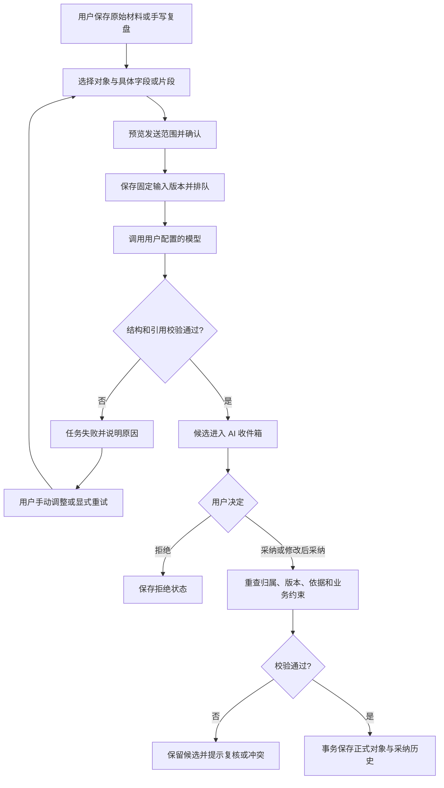
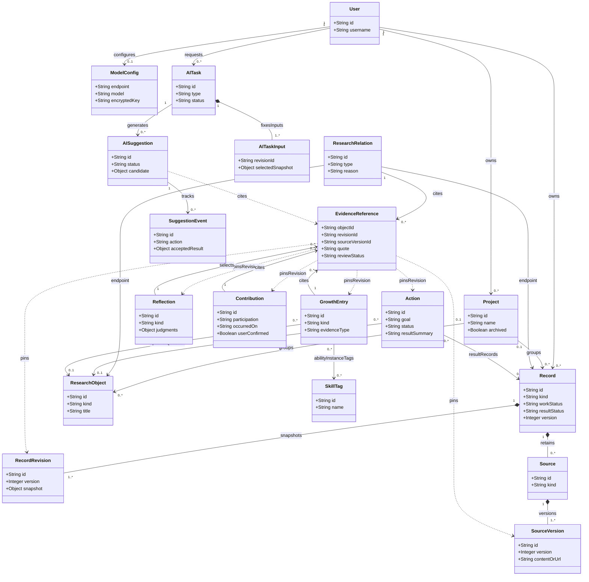

# 研迹：软件系统功能规格说明书

## 0. 文档信息

| 项目 | 内容 |
| --- | --- |
| 系统名称 | 研迹，ResearchTrail |
| 版本与日期 | v1.0 · 2026-10-08 |
| 适用范围 | M1–M5-A：个人科研记录、研究地图、贡献与成长、行动复盘、可选 AI 辅助及业务导出 |
| 阅读对象 | 课程项目组、开发者、测试人员及课程评审 |
| 编号规则 | FR-01–FR-08 沿用项目说明；FR-xx.y 为细化需求；NFR-x 为非功能需求；AG-x 为 AI 功能职责 |
| 文档位置 | `docs/requirements/functional_specification.md` |

[返回项目入口](../../README.md) · [问题定义与产品描述](problem_definition.md) · [项目说明](../PROJECT_OVERVIEW.md) · [功能指南](../FEATURE_GUIDE.md) · [架构](../ARCHITECTURE.md) · [功能测试](../FUNCTIONAL_TESTS.md) · [开发进度](../DEVELOPMENT_PROGRESS.md)

## 1. 系统角色（Actor）

### 1.1 人类角色

| 角色 | 目标与操作 | 权限边界 |
| --- | --- | --- |
| 研究生用户 | 管理个人研究项目，记录活动与判断，建立研究关系，记录贡献和成长，选择行动并复盘；核对、修改、采纳或拒绝 AI 候选 | 仅访问本账号业务数据和模型配置；可关联自己不同项目的对象 |
| 开发与测试人员 | 使用虚构材料验证功能，维护需求、实现、测试及交付说明 | 属于项目协作身份；应用内按普通账号隔离，不拥有读取他人材料的特殊权限 |
| 本地运行维护者 | 安装启动应用、管理本机配置、备份恢复数据库及主密钥 | 属于部署职责；当前没有应用内管理员角色、用户授权后台或团队共享空间 |

### 1.2 系统外部角色

| 外部角色 | 与系统的交互 |
| --- | --- |
| 兼容模型服务 | 接收用户显式选择的材料及任务指令，返回结构化草稿或候选；提供 OpenAI Chat Completions 兼容接口 |
| 本地文件系统 | 提供 Markdown/纯文本导入文件，保存 SQLite 数据库、独立主密钥及用户下载的业务文件 |

论文、代码和实验结果链接是来源信息，不意味着系统会访问对应网站。SQLite 和任务执行器属于系统内部组件。

### 1.3 AI 功能职责（Agent Roles）

本项目采用固定任务工作流。下面的 AG 编号用于划分 AI 职责，五类任务复用模型配置、任务队列、输入快照、结构校验和收件箱；不表示已经实现五个自主通信的智能体、DAG 编排或自动重规划。

| 编号 | AI 功能职责 | 输入 | 输出与确认方式 |
| --- | --- | --- | --- |
| AG-1 | 探索卡整理 | 用户选择的已保存记录字段或来源片段 | 结构化字段草稿；用户逐字段核对后采纳 |
| AG-2 | 研究关系建议 | 2–20 个已有研究对象，至少一条科研记录 | 最多 10 条关系候选，含方向、类型、理由和引用；逐条确认 |
| AG-3 | 贡献候选整理 | 1–20 条记录的选定字段或来源 | 最多 10 条贡献候选；本人参与未知时留空，用户确认归属及依据 |
| AG-4 | 行动建议 | 1–20 个显式选择对象的字段，以及目标和可选限制 | 最多 5 条候选；用户修改、选择日期并采纳为待开始行动 |
| AG-5 | 周复盘辅助整理 | 已保存周期复盘中的用户文字及选定的已关联固定版本材料 | 四个复盘字段的建议；用户选择不采用、追加或替换 |

## 2. 功能树（Feature Tree）

### 2.1 FR-01 科研记录与待整理收件箱

- **FR-01.1 快速记录：**支持随手记、论文阅读、实验尝试、AI 协作、灵感疑问五种类型。标题或正文至少一项有效即可保存，项目与结构化字段允许后补。
- **FR-01.2 结构化探索卡：**支持背景、行动、观察、个人判断及后续想法等字段；工作状态与结果判断独立保存，不因工作结束自动认定假设得到支持。
- **FR-01.3 文本导入：**支持 UTF-8/BOM 的 `.md`、`.txt` 单文件，最大 1 MiB；预览后确认保存，保留文件名和原文。非法编码、空白内容和超限文件须明确拒绝。
- **FR-01.4 查询与生命周期：**支持中文关键词、项目、类型、工作状态及结果判断筛选与分页；提供编辑、历史、软删除和恢复，恢复保留对象标识。
- **FR-01.5 AI 整理：**用户选择字段或来源片段并预览后发起任务；草稿先进入收件箱，已有字段不默认勾选替换，采纳不覆盖原始材料。
- **FR-01.6 收件箱处理：**支持按任务类型、状态和项目筛选，逐条核对、修改、采纳、拒绝及批量拒绝；未采纳候选不成为正式业务对象。

### 2.2 FR-02 研究地图

- **FR-02.1 研究对象：**支持手动创建问题、发现和候选方向；记录通过有效关系进入地图，取消关联不删除原记录。
- **FR-02.2 关系表达：**支持关联、子问题、源于、验证、支持、质疑、延伸、复用八种关系，保存端点、方向、理由及可选证据。除普通关联外要求理由；拒绝自连接和有效重复关系。
- **FR-02.3 子问题约束：**仅允许问题之间建立子问题关系，每个问题最多一个父问题，禁止成环；一般研究关系不套用此树约束。
- **FR-02.4 浏览与布局：**支持项目地图、个人总览、跨项目一层邻居、局部展开、筛选和布局保存。画布最多 150 个节点，截取须提示；完整对象可分页浏览，窄屏提供列表操作。
- **FR-02.5 AI 关系候选：**只分析用户选择的已有对象，展示候选理由及引用；采纳仍需校验归属、端点、重复关系和子问题约束，不自动创建研究节点。
- **FR-02.6 证据复核：**关系引用固定版本和片段；来源变化提示待复核，删除显示不可用占位，复核不把旧引用悄悄改为新版本。

### 2.3 FR-03 个人贡献时间线

- **FR-03.1 贡献录入：**支持提出问题、作出选择、修正建议、设计验证、形成理解、建立联系六种类型，保存发生日期、本人参与、AI/他人帮助及可选影响。
- **FR-03.2 归属确认：**保存贡献要求用户确认本人参与；无材料可保存自述，但须显示“用户自述／待补依据”，不宣称系统证明贡献归属。
- **FR-03.3 时间线与历史：**按项目、发生日期、类型及关键词查询，提供固定证据、编辑历史、删除恢复及来源复核。
- **FR-03.4 AI 贡献候选：**用户选择记录生成候选，采纳前核对日期、参与及至少一项原引用；新增事实单独标识为用户补充，同一建议不能重复创建贡献。

### 2.4 FR-04 成长档案与理解变化

- **FR-04.1 能力标签：**支持新增、改名、归档和恢复；标签名称在同账号内唯一，历史保留当时名称，不自动计算能力分数或等级。
- **FR-04.2 能力实例：**实例至少关联一个标签，支持“在帮助下完成”“独立完成”“迁移到新情境”等描述，并区分自述、材料记录和任务实践依据。
- **FR-04.3 依据约束：**材料记录要求记录、行动或复盘依据；任务实践要求有结项说明的完成行动快照，不能把自述自动提升为已验证材料。
- **FR-04.4 理解变化：**之前和现在的理解必填，允许独立保存或关联研究问题；前、触发、后依据分别固定版本，不自动修改研究问题结论。
- **FR-04.5 跨模块连接：**从记录、行动、复盘进入成长表单；从成长详情显式创建带来源版本的后续行动，周复盘可引用贡献和成长版本。

### 2.5 FR-05 尝试复盘与暂缓管理

- **FR-05.1 尝试复盘：**从记录或行动进入，保存原先期待、实际结果、已知与未知、解释、可复用材料及选择理由。
- **FR-05.2 暂缓与重启：**允许记录继续、调整、暂缓或结束的判断以及重新考虑条件；保存复盘本身不自动改变方向或行动状态。
- **FR-05.3 不确定性表达：**区分实际观察和待核实解释，允许证据不足及当前条件下未支持，不自动把失败写成成长结论。

### 2.6 FR-06 方向池与下一步计划

- **FR-06.1 方向管理：**保存来源、支持与反对证据、不确定性、资源和最小验证行动，支持候选、重点、暂缓、关闭状态与手动优先级。
- **FR-06.2 行动管理：**支持独立行动或关联已有方向，保存目标、可选学习目标、完成标准、预计日期及状态；从方向创建可预填项目，由用户确认。
- **FR-06.3 行动结项：**完成要求结果说明，可关联已有记录或创建新结果记录；结项不自动关闭方向、改写记录结果或生成成长条目。
- **FR-06.4 原子保存：**结项、可选结果记录、明确勾选的方向关系及历史须一起提交或回滚；请求重试不重复创建，重新开启完成/取消行动须填写原因。
- **FR-06.5 AI 行动建议：**用户选择材料字段、目标与限制并预览；候选须含理由与依据，只能引用本次选择中的已有方向。逐条采纳为待开始行动，不自动安排日程或执行实验。

### 2.7 FR-07 周复盘

- **FR-07.1 时间范围与材料：**支持本地自然周及自定义日期范围，将范围转换为 UTC 半开区间，按版本变化提供候选材料；用户只选择需要的固定版本。
- **FR-07.2 自主判断：**记录本周推进、认识变化、受阻事项与下一步选择，允许手动完成；保存后才显式创建行动或调整方向。
- **FR-07.3 AI 辅助整理：**先保存用户自己的复盘文字，再从该复盘已关联的固定版本中选择参考内容；不自动扩展材料或生成理解变化。
- **FR-07.4 字段采纳：**每字段可不采用、追加或替换，已有文字默认不采用，提交前展示最终结果；部分字段采纳即结束该条建议，保留原候选和采纳历史。

### 2.8 FR-08 来源、导出与基本数据保护

- **FR-08.1 账号与项目：**提供注册、登录、退出及项目创建、编辑、归档恢复；项目归档保留资料并限制修改，用户数据及模型配置按账号隔离。
- **FR-08.2 固定来源与历史：**保存原始材料、来源版本、对象修订及片段引用；修改后只追加历史，删除依据显示占位，不泄露已删除正文。
- **FR-08.3 模型配置：**用户设置兼容接口 URL、模型名和 API Key；预览最终请求地址，连接测试只发送固定短文本。Key 后端加密存储，页面不返回明文，主密钥独立保存。
- **FR-08.4 外部调用边界：**只发送已确认的材料，每次输入最大 32,000 Unicode 字符，行动任务计入目标和限制；不自动抓取来源链接、展开下层证据或追加付费修复调用。
- **FR-08.5 业务导出：**支持全部、选定项目、未归类或手选对象范围，先预览再下载；JSON 使用 `yanji.business.v1`，Markdown 正文仅覆盖记录与复盘。
- **FR-08.6 导出一致性：**列明固定版本、跨项目依据、归档内容及删除占位；预览后材料变化要求重新预览。超过 5,000 条对象/版本/关联摘要或 20 MiB 时拒绝，不静默截断。
- **FR-08.7 导出排除项：**业务文件不包含账号凭据、会话、模型 Key、完整 AI 任务及未采纳候选；业务导出不作为可重新导入的数据库备份。
- **FR-08.8 备份恢复：**提供 SQLite 一致性备份及停服恢复步骤；数据库备份不包含独立主密钥，跨电脑恢复须分别保管和恢复两者。

## 3. 非功能需求（Non-Functional Requirements）

下列条目是可核对的项目约束与验收要求，不是已测得的性能结论。

| 编号 | 类别 | 需求与验证方式 |
| --- | --- | --- |
| NFR-1 | 数据隔离 | 所有对象、父级、引用、历史、布局、AI 候选和导出均校验当前账号归属；使用双账号及替换对象 ID 验证拒绝越权 |
| NFR-2 | 数据一致性 | 修改使用版本校验，旧版本返回冲突且保留输入；多对象业务写入采用事务，同一创建请求或建议的重放不产生重复正式对象 |
| NFR-3 | 可追溯性 | 正式内容可回看当时修订、固定材料和 AI 采纳记录；变化、删除、恢复及复核须有明确展示，不将引用存在当作语义正确 |
| NFR-4 | 可靠性 | 模型、网络或数据库错误须明确反馈，已保存手动资料保持可用；取消不承诺撤销上游处理/计费，不自动重复付费请求 |
| NFR-5 | 并发与资源 | 全局最多 2 个 AI 运行任务，每账号最多 1 个运行及 5 个排队；默认模型请求总时限 120 秒；用隔离环境验证排队、限额、超时及重启行为 |
| NFR-6 | 输入与规模 | 机械检查 1 MiB 文件、32,000 Unicode 字符输入、150 画布节点及 5,000 项/20 MiB 导出边界；测试 500 节点/1,000 关系时提供截取提示和完整分页 |
| NFR-7 | 安全性 | 会话、CSRF/Origin、密码哈希及模型 Key 加密按架构约定执行；安全展示用户文本，禁止危险来源协议；模型地址及重定向按既有规则校验 |
| NFR-8 | 可用性 | 桌面与 390×844 窄屏可完成关键操作；地图操作有表单/列表入口，失败及会话过期后保留输入，关键流程不依赖拖拽 |
| NFR-9 | 可维护与部署 | 按 README 在新环境启动 React/FastAPI/SQLite，无需 Docker；迁移失败停止启动并保留原库；模型提示词与输出结构纳入版本管理 |
| NFR-10 | 验证可信度 | 自动化、模拟模型、真实模型和手工验收分别登记；未执行不得标通过，软件测试不作为提升科研能力或学习效果的证明 |

## 4. 典型业务流程与 AI 错误处理

### 4.1 科研探索闭环

1. 用户登录并创建项目，导入一条未达预期的实验记录，保留原文并补充行动、观察和个人判断。
2. 用户可手动整理，也可选定字段发起 AG-1；核对引用后只采纳需要的字段。
3. 用户建立研究问题与记录的关系，保存带条件的发现；需要时通过 AG-2 获取候选关系，确认后加入地图。
4. 用户记录自身贡献和理解变化；AG-3 可辅助提出贡献候选，但本人参与及归属由用户确认。
5. 用户选择方向并创建最小验证行动；AG-4 可提供候选，行动目标、日期和完成标准由用户决定。
6. 完成行动后填写结果说明，选择是否关联结果记录；保存尝试复盘和手写周复盘。
7. 用户可通过 AG-5 辅助整理已保存周复盘，逐字段查看最终文本，再明确选择后续行动。
8. 用户按范围预览并导出业务资料。原始材料、判断、固定证据和采纳历史保持可追溯。

### 4.2 固定 AI 工作流

任务状态为 `queued/running/succeeded/failed/cancelled`；建议状态为 `pending/accepted/edited_accepted/rejected`。任务成功只表示合法候选已生成，不表示用户采纳或科研结论成立。

| 异常 | 系统应有的行为 |
| --- | --- |
| 未配置模型或主密钥缺失 | 解释配置/恢复要求，保留手动功能；已有密文的主密钥缺失时不自动用新密钥替换 |
| 模型鉴权失败、限流、超时、网络错误 | 展示任务失败原因，不退出应用账号，不改变原始记录；由用户显式重试 |
| 输出格式不合法或引用越界/错版本 | 拒绝不合法输出，不保存部分正式内容，不自动发起修复模型调用 |
| 采纳前来源发生变化 | 提示复核或版本冲突，用户核对旧依据或重新生成；不静默替换输入版本 |
| 来源已删除、项目归档或对象越权 | 阻止不合法采纳；已有历史保留可解释的占位或只读内容 |
| 重启时任务中断 | 运行任务标记失败并由用户重试；排队任务重新校验后继续，不承诺自动断点续跑 |
| 重复采纳或事务中途失败 | 同一建议最多生成一次正式结果；多对象与事件一起成功或回滚 |

## 5. 领域模型（Domain Model UML）

以下为业务概念类图，说明对象职责及关联，数据库表名、字段、外键和迁移以架构及实际模型为准。`ResearchObject` 概括问题、发现、方向；`GrowthEntry` 概括能力实例和理解变化；`EvidenceReference` 概括固定版本引用。

关系端点可分别是记录或研究对象，每条关系恰有两个合法端点；图中的两条关联表示可选端点类别。固定引用也可指向行动、复盘、贡献和成长的修订，图中省略其独立修订类以保持可读性。能力实例至少有一个标签，理解变化不要求标签。项目为可选归类，所有业务对象仍归属一个用户；类图未逐条画出共用的账号归属和历史关系。

## 6. 验收标准与需求追溯

本节使用既有稳定测试编号，不新增另一套执行状态。各模块实际步骤、异常变体、自动化入口及批次记录见[功能测试文档](../FUNCTIONAL_TESTS.md)。

| 需求范围 | 通过条件 | 既有用例入口 |
| --- | --- | --- |
| FR-01 | 中文记录与导入可保存重开；工作/结果独立；原文和历史保留；失败输入不丢失 | FT-REC-001–010、FT-IMP-001–005、测试文档第 6.4/6.6 节 |
| FR-02 | 地图关系有方向和依据，子问题单父无环；跨项目与截取明确；仅采纳合法候选后入图 | FT-GRAPH-001–008、FT-REL-001–008、FT-AIREL-001–005 |
| FR-03 | 本人参与经确认，自述明确；固定材料可回看，AI 候选不重复入库 | FT-CONTRIB-001–010 |
| FR-04 | 标签与实例关联正确，依据类型受约束；理解前后保留，后续行动显式创建 | FT-GROW-001–012 |
| FR-05 | 尝试期待、实际、解释及暂缓条件可回看，不自动改写方向或原结果 | FT-REFL-001、FT-ACT-001 |
| FR-06 | 行动结项有说明，多对象保存原子且幂等；AI 候选由用户确认，日期不自动安排 | FT-ACT-001–006、测试文档第 9.3 节 PLAN 用例 |
| FR-07 | 时间范围与固定版本正确；先保存手写判断，AI 逐字段采纳可预览并保持历史 | FT-REFL-002–005、测试文档第 9.3 节 PLAN 用例 |
| FR-08 | 双账号不能越权；模型输入和凭据边界明确；导出范围/版本一致、超限拒绝、排除秘密和未采纳候选 | 测试文档第 4.1/4.5/6.1–6.3/7 节、FT-EXPORT-001–015 |
| NFR-1–10 | 隔离、事务、故障、限额、桌面/窄屏及新环境启动满足第 3 节约束，并有对应证据 | 测试文档第 2、7、8、10–12 节 |

首版完整验收故事为：**账号 A 保存未达预期的记录 → 核对 AI 草稿 → 建立问题及带证据关系 → 记录贡献与理解变化 → 选择行动并结项 → 手写复盘及按需 AI 整理 → 导出 → 账号 B 检查隔离 → 重启检查数据保留。** 真实模型验收另行核对字段忠实性、引用语义、缺失信息和不确定性；连接测试成功不替代输出质量验收。

## 7. 范围与维护约定

当前不提供自主多智能体协商、能力注册和消息总线、DAG 重规划、长期向量记忆、自动研究结论、自动日程、团队共享、云同步、网页抓取、PDF/图片解析、永久删除、历史回滚或业务重新导入。历史记录与固定输入快照用于回看和追溯，不宣称已经实现模板示例中的多智能体记忆系统或不可篡改审计平台。

后续需求沿用 FR-01–FR-08 主编号并追加细化项；实现改变时同步项目说明、指南、架构、测试及进度。本文为功能规格，问题假设见问题定义，页面步骤见指南，数据/API 契约见架构，实际通过情况见测试批次，避免把说明补充误记为新增功能或测试通过。
